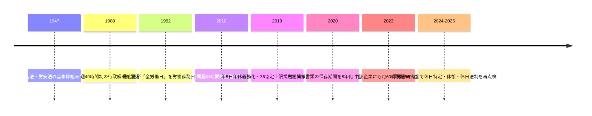

> **【プロジェクト管理用コピー・出所明示】**
> 本ファイルは 2026-06-13 時点で ChatGPT deep-research が出力した「社労士チェックリスト検証報告書」の記録です（原本: 個人デスクトップ）。
> - 本文は当時の出力のまま保存しており、文中の「GitHub文書 247〜258 行」等は **当時の `docs/LABOR_LAW_REVIEW_NOTES.md` の旧行番号**を指す（現在の行とは一致しない）。報告書の 12 項目は現行台帳の #1〜#12 に対応。
> - 引用トークン（`turn..view0` 等）は ChatGPT 内部参照で検証不能。
> - **原典再照合（jp-labor-evidence MCP）の結果と確定結論は [`LABOR_LAW_REVIEW_NOTES.md`](LABOR_LAW_REVIEW_NOTES.md)「報告書原典再照合（2026-06-13）」を正（SSOT）とする。**

---

# 指定GitHubドキュメントの社労士チェックリスト検証報告書

## エグゼクティブサマリ

- GitHub文書のチェックリストは、**方向性として正しい項目が多い**一方で、**法文上の基準**と**実務上の安全側運用**が混在している箇所があります。特に、年休5日義務の「10日以上」判定、法定休日未特定時の処理、勤務パターン未割当日の集計除外は、そのまま仕様化すると過不足が生じやすい論点です。citeturn44view0turn26search7turn39view0turn50view0
- **最優先の修正対象**は、①振替休日と代休の法的区別、②実労働時間での休憩再判定、③36協定・産業医面談・月60時間超割増のカウンタ分離です。これらは未整備だと未払残業、面接指導漏れ、休日割増の誤計算に直結します。citeturn20view0turn24search8turn3search1turn34search7turn3search3
- **法定休日は就業規則等で明示特定するのが最善**です。未特定時に裁判所は「その週の最後の休日」やシフト表上の休日を黙示指定とみる傾向があり、単純に「日曜固定」「全部35%」のいずれにも直行しません。GitHub文書の「労働者有利で35%側」は安全側ポリシーとしては理解できますが、法的な一般解としては強すぎます。citeturn39view0turn46search3turn46search5
- **年休5日義務は二層管理**に改めるのがベターです。すなわち、対象判定は「当年度の法定付与（日数の前倒し分を含む）」で行い、5日充足の計算では自発取得・計画年休・繰越年休の取得実績を控除する、という分離です。単純な「繰越込み合算対象」より法文適合性が高く、かつ実務にも乗ります。citeturn26search7turn26search0turn25search1turn27search1
- **割増率・罰則の根拠条文には修正が必要**です。法定休日35%が政令根拠である点は正しいですが、時間外・休日・割増賃金や上限規制違反の刑事罰の典拠は、通常は労基法120条ではなく**119条**です。GitHub文書のこの点は修正推奨です。citeturn41search0turn52search2turn52search8turn52search10
- **勤務パターン未割当日をNULLで集計から落とす設計は、コンプライアンス集計の出荷前仕様としては不可**です。客観記録に基づく暫定計算と例外フラグ管理に切り替え、賃金・36協定・面接指導の母数から漏らさないことを推奨します。保存は少なくとも当面3年、実務上は5年基準での保持が安全です。citeturn50view0turn49search1turn49search4turn49search5

## 調査対象と評価軸

本報告書は、GitHub上の `LABOR_LAW_REVIEW_NOTES.md` のうちチェックリスト部分、具体的には **247行から258行**に掲げられた12項目を対象に、一次資料優先で検証したものです。各項目について、GitHub記載の論点を起点に、公開裁判例、厚生労働省・労働局の通達やQ&A、公開されている労務相談・実務解説を照合し、**「法文上の最小要件」**と**「社労士として勧める安全側実務」**を切り分けて提案します。各判例・通達名の末尾に付した出典リンクが、当該本文または公開要旨のURLです。citeturn44view0

今回の検証では、特に次の三つの観点を重視しました。第一に、**法文・政令・省令に忠実か**。第二に、**現実の裁判所がどう処理しているか**。第三に、**システム仕様として実装したときに、未払賃金・是正勧告・監督対応で破綻しないか**、です。したがって、GitHub文書の記述が「安全側運用」としては有益でも、法的な一般原則としては強すぎる場合には、その点を明記しています。citeturn41search0turn41search1turn34search7turn49search1

主要な制度変化を時系列で押さえると、解釈の位置づけが見えやすくなります。

上の流れは、年休5日義務・36協定上限規制・面接指導の拡張が2019年以降に集中していること、そして保存期間や休日特定の実務がなお調整過程にあることを示しています。したがって、システム仕様も「昔からの慣行」でなく、2019年以降の法制を中心に再設計する必要があります。citeturn26search3turn31search0turn49search1turn46search3turn21search1

## 年休と休業管理

### 年休5日取得義務の対象判定

**該当箇所の要約**  
GitHub文書247行は、年休5日取得義務の対象となる「10日以上」について、**新規付与のみで判定するか、繰越を含めて合算で判定するか**を論点化し、仕様上は「安全側（合算）を既定」としています。citeturn44view0

**判例**  
この論点について、労基法39条7項の「10日以上」判定そのものを正面から争った公開裁判例は、今回確認した範囲では見当たりませんでした。代替的に参照すべき基礎判例は、**最高裁1992年2月18日・平成2年(オ)1860号・エス・ウント・エー事件**です。最高裁は「全労働日」を「**労働契約上労働義務を課せられている日数**」と解し、労働義務のない休日を年休の母数に混ぜることを否定しました。これは39条7項の直接判断ではありませんが、年休制度の適用対象や計算は、あくまで**当年度に法が保障する年休権**を単位にみるべきだという基礎線を与えます。判旨の要点は「『全労働日』とは…労働義務を課せられている日数」であり、判決文・要旨は出典先参照です。citeturn45search2turn45search7

**行政通達・ガイドライン**  
厚労省Q&Aは、**前倒し・分割付与**の場合には「**付与日数の合計が10日に達した日**」から5日義務が始まると明示しています。また、労働者がその前に取得した年休や、前年度からの繰越年休の取得実績は、5日義務から控除できると説明しています。つまり行政実務は、**対象判定の起点**と**5日履行の充足計算**を別々に扱っています。ここが実務上の最重要点です。citeturn26search7turn26search0turn25search1turn26search10

**実務事例・公開ケース**  
厚労省「スタートアップ労働条件」は、年5日義務は**労働者ごとの基準日管理**が必要であり、自発取得や計画年休分は控除すべきだとしています。半日年休は0.5日換算で控除できる一方、時間単位年休は控除不可です。さらに、労働局公表では時季指定義務違反の指摘事例が実際に相当数存在しており、「ざっくり有給残数だけ見る」運用では足りないことが分かります。citeturn27search0turn27search1turn27search5turn27search3

**比較分析と結論**  
結論として、GitHub文書の「合算基準」は**未履行防止のための社内安全側ルール**としては理解できますが、**法令上の標準解釈**としてはやや広すぎます。より適法性が高い整理は、  
- **対象判定**：当年度の法定付与日数が10日に達したか（前倒し・分割付与の合計を含む）  
- **5日充足計算**：労働者自発取得、計画年休、繰越年休の取得実績も控除可  
という二層管理です。したがって、仕様書は「対象判定＝新規付与ベース」「充足計算＝取得実績ベース」に書き換えるのがベターです。citeturn26search7turn25search1turn27search1

**社労士としての具体的推奨対応**  
就業規則・運用基準の文例は次のとおりです。  
「年5日の時季指定義務の対象者は、当年度に労働基準法39条所定の年次有給休暇が10日以上付与される者とする。年休を法定基準日前に前倒し又は分割付与する場合は、当年度付与日数の合計が10日に達した日を基準日とする。なお、当年度中に労働者が自ら請求取得した年休、計画的付与により取得した年休及び繰越年休の取得実績は、法39条7項の5日履行確認に算入する。」  
システム上は、`annual_entitlement_current_year` と `five_day_obligation_satisfied_days` を別項目で持ち、前者で対象判定、後者で履行確認を行う設計を推奨します。citeturn26search7turn27search0turn27search5

### 会社休業日を有給扱いする設定

**該当箇所の要約**  
GitHub文書256行は、会社の休業日を有給消化日として扱う `counts_as_paid_leave=true` 運用について、**計画的付与なのか、使用者都合休業なのか**を分けるべきだと問題提起しています。citeturn44view0

**判例**  
直接に `counts_as_paid_leave` のようなシステム設定を争った判例は見当たりません。ただし、前記**エス・ウント・エー事件**で、最高裁は年休制度の基礎となる「全労働日」を**労働義務日**で捉えました。これは裏返すと、**もともと労働義務のない日**や会社が一方的に設定した休業日を、そのまま年休に読み替えることには慎重であるべきことを意味します。citeturn45search2turn45search7

**行政通達・ガイドライン**  
厚労省は、**計画的付与制度**を導入する場合、労使協定により「5日を超える部分」について一斉付与や個人別付与が可能であり、計画年休で取得した日数は5日義務にもカウントできると説明しています。逆に、労使協定に基づかない**会社都合の休業**は年休充当の領域ではなく、原則として**労基法26条の休業手当**の問題です。したがって、会社の一斉休業日を年休扱いにできるのは、法39条6項の計画的付与の要件を満たす場合に限られます。citeturn45search0turn45search4turn45search5

**実務事例・公開ケース**  
「スタートアップ労働条件」でも、計画年休は「5日を超える部分」に限って労使協定で導入すると整理されており、会社が単独で閉所日を年休消化日にする説明にはなっていません。GitHub文書の懸念は実務上正当です。citeturn45search5turn45search9

**比較分析と結論**  
この項目の結論は明快です。`counts_as_paid_leave=true` を許容してよいのは、  
- 労使協定に基づく**計画的付与**  
- 労働者の**本人請求**  
- 使用者による**法39条7項の時季指定**  
のいずれかであり、**単なる会社都合休業**ではありません。したがって、GitHub文書の問題意識は妥当で、仕様上は**休業手当処理と年休処理を厳密に分離**すべきです。citeturn45search0turn45search5turn27search1

**社労士としての具体的推奨対応**  
実装条件は、少なくとも次のチェックを通した場合にだけ `counts_as_paid_leave=true` を許すのが適切です。  
- 労使協定IDの存在  
- 当該労働者に**5日超部分**の年休残数がある  
- 当該日が本来の労働義務日である  
- 当該処理区分が「計画年休」「本人請求年休」「時季指定年休」のいずれかである  
文例は、  
「会社休業日を年次有給休暇として処理する場合は、労基法39条6項に基づく労使協定又は労働者本人の請求若しくは39条7項の時季指定による場合に限る。使用者都合による休業は、別途休業手当又は特別有給休暇として処理する。」  
とするのが無難です。citeturn45search0turn45search5

## 時間外労働と休日設計

### 36協定の算定基礎二系統

**該当箇所の要約**  
GitHub文書248行は、36協定の上限管理について、**月45時間・年360時間・特別条項年720時間・年6回**は「時間外のみ」、**単月100時間未満・2〜6か月平均80時間以内**は「時間外＋法定休日労働」である、という二系統管理を示しています。citeturn44view0

**判例**  
2019年改正後のこの「二系統集計」自体を正面から争った公開裁判例は、今回確認した範囲では見当たりませんでした。ただし、休日労働の扱いについては、古い裁判例でも**36協定の対象となる休日は労基法35条の休日**であるとされており、法定休日と法定外休日の区別が集計上重要である点は一貫しています。行政・実務の扱いもこの前提に立っています。citeturn22view0turn37view0

**行政通達・ガイドライン**  
厚労省Q&Aと様式記載心得は、**月45時間・年360時間等は法定時間外労働の時間数**で管理し、**単月100時間未満・複数月平均80時間以内は時間外労働と休日労働の合算**でみると整理しています。36協定届の裏面記載心得でも、100時間・80時間基準は「時間外労働及び休日労働を合算した時間数」で判断するとされています。GitHub文書の理解はここは正確です。citeturn46search11turn52search8turn52search6

**実務事例・公開ケース**  
公開の労働局教材でも、土日週休2日制であれば、日曜日の法定休日労働と土曜日の法定外休日勤務を別区分にし、36協定上の管理や割増計算も分ける例が示されています。つまりシステム上も、**単一の「残業時間」カラムでは足りない**ということです。citeturn46search1turn46search7turn21search7

**比較分析と結論**  
この項目の結論は、GitHub文書どおり**二系統集計が必須**です。法定休日の指定が曖昧だと、この二系統のどちらにも誤差が伝播します。したがって、36協定管理は「労働時間外」と「法定休日労働」を別記録にした上で、場面ごとに合算・非合算を切り替える設計にすべきです。citeturn46search11turn52search8turn46search7

**社労士としての具体的推奨対応**  
推奨する内部カウンタは三つです。  
- `statutory_overtime_hours`：1日8時間・1週40時間超の法定時間外  
- `legal_holiday_hours`：法定休日労働  
- `special_limit_hours`：上記二つの合算  
月45時間・年360時間・年720時間・年6回は第1カウンタ、単月100時間・平均80時間は第3カウンタで判定します。月次レポート文例は、  
「当月の法定時間外労働は42時間、法定休日労働は14時間、上限規制上の合算時間は56時間です。特別条項カウントは未使用です。」  
といった形が実務上分かりやすいです。citeturn52search8turn46search1

### 週40時間超の法定時間外

**該当箇所の要約**  
GitHub文書250行は、**各日8時間未満でも、週40時間を超えれば法定時間外であり、25%割増と36協定カウントの対象になる**と整理しています。citeturn44view0

**判例**  
この点は裁判例が比較的明瞭です。**東京地裁2007年8月24日・平成18(ワ)25275・三英冷熱工業事件**は、週45時間契約の下で、1日8時間を超えない部分であっても、**週40時間を超えた後の労働には割増賃金が発生する**と判断しました。判旨の要点は「**週当たりの労働時間の累計が…40時間を超過した後**の時間外労働については、その日の労働時間としては8時間を超えない部分であっても割増賃金が発生する」というものです。さらに、**大阪地裁2001年4月27日・平成12(ワ)4598・関西警備保障事件**も、週40時間を超える所定内労働時間は時間外労働だと判示しています。citeturn51view0turn42view0

**行政通達・ガイドライン**  
厚労省は、昭和63年の通達で、1週間とは就業規則等に別段の定めがない限り**日曜日から土曜日までの暦週**であり、週40時間と1日8時間はいずれも法定労働時間であると整理しています。つまり、「1日8時間以下だからセーフ」は成り立ちません。citeturn46search0

**実務事例・公開ケース**  
労基法の一般向け解説でも、法定外休日勤務であっても**週40時間を超えた部分**は25%の時間外割増が必要になる例が示されています。土曜勤務が法定休日でないからといって、割増不要になるわけではありません。citeturn46search4turn46search7

**比較分析と結論**  
GitHub文書の記述は正確です。実務上の注意点は、**「所定内残業」**と社内で呼んでいる時間の中に、法的には週40時間超の**法定時間外**が混じり得ることです。変形労働時間制を採るなら別ですが、その場合も有効要件を満たさなければ通常の32条規制に戻ります。citeturn51view0turn42view0turn46search0

**社労士としての具体的推奨対応**  
運用ルールは、  
「1日計算」「週計算」を必ず併用し、いずれかで法定時間を超えた部分を法定時間外として集計する。  
変形労働時間制を導入する場合は、就業規則・労使協定・勤務カレンダで各週各日の所定労働時間を事前特定し、それがない期間は通常の32条判定に戻す。」  
と明文化すべきです。アラート文例は、  
「本日の勤務は1日8時間以内ですが、今週累計が40時間を超過したため、本日18:20以降は法定時間外として集計します。」  
が実務的です。citeturn51view0turn46search0

### 法定休日の特定

**該当箇所の要約**  
GitHub文書251行は、`legal_holiday` を就業規則で特定し、**未特定なら労働者有利に35%側**で扱うという設計方針を置いています。citeturn44view0

**判例**  
ここはGitHub文書をそのまま仕様化しない方がよい論点です。**大阪地裁2013年4月9日・平成24(ワ)1879号ほか**は、使用者が法定休日を明示指定していなくても、**シフト表（事務所交番表）に従って取得している休日**から、暦週に1回休日がある場合はその日を、2回以上ある場合は**最後の休日**を法定休日と黙示指定していたと認定しました。さらに休日がまったくない週は**暦週の最終日**を法定休日とみています。判旨のエッセンスは「**2回以上休日がある場合には最後の休日**」「**暦週の最終日である土曜日を法定休日**」です。加えて、**東京地裁2000年2月23日・平成10(レ)175ほか・最上建設事件**は、法定休日と法定外休日は法的に異なり、35%が当然にかかるのは法定休日のみだと整理しています。citeturn40view0turn39view0turn37view0

**行政通達・ガイドライン**  
厚労省研究会資料は、法35条自体は休日の曜日固定まで要求していないが、**行政解釈上は就業規則等での特定が望ましい**と整理しています。4週4休制を採る場合は、**4週間の起算日を明示**し、できるだけ休日を特定するよう労働局資料でも案内されています。citeturn46search3turn46search5

**実務事例・公開ケース**  
厚労省Q&A「土日の手当に差があります」は、日曜を法定休日と定めているなら日曜に35%、土曜は週40時間超部分のみ25%と説明しています。これは、**法定休日を明示した方が賃金計算も従業員説明も安定する**ことを示します。citeturn46search7

**比較分析と結論**  
結論として、GitHub文書の「未特定は35%側」は**安全側ポリシー**としてはあり得ますが、裁判所の一般処理をそのまま表してはいません。裁判所は、未特定だからといって直ちに全休日を35%扱いするのではなく、**週の中から法定休日を一つ推認**します。したがって、仕様上のベターは、  
- 原則：法定休日を明示特定  
- 未特定時：シフト履歴等から暦週単位で法定休日を推認  
- 推認不能時：35%側の仮計上＋高リスクアラート  
です。citeturn39view0turn46search3turn46search5

**社労士としての具体的推奨対応**  
就業規則文例は、  
「法定休日は毎週日曜日とする。業務上必要がある場合は、就業規則所定の手続により他の日に振り替えることがある。」  
4週4休制なら、  
「4週間の起算日は毎年4月1日とし、各4週間につき4日の休日を別表勤務カレンダで指定する。法定休日は当該カレンダにおいて『法定休日』と表示した日とする。」  
が明確です。システムでは `legal_holiday` を**有効期間付きマスタ**で持ち、空白期間が生じたら計算を続ける前に警告を出す設計が望ましいです。citeturn46search5turn46search7

### 月60時間超カウントからの法定休日除外

**該当箇所の要約**  
GitHub文書252行は、**法定休日労働は「月60時間超」の50%割増カウントに含めない**と整理しています。citeturn44view0

**判例**  
この論点を直接の争点とした公開裁判例は、今回確認した範囲では多くありません。ただし、近時の未払残業訴訟では、**「時間外割増賃金②（60時間超）」**と**「法定休日割増賃金」**を別欄で計算する実務が公開判決文にも現れており、裁判実務でも区分計算が定着していることが分かります。citeturn38search7

**行政通達・ガイドライン**  
法37条1項ただし書の月60時間超割増は、文言上「**延長して労働させた時間**」が対象であり、法定休日労働はここに含まれません。厚労省の解説も、月60時間超の時間外割増と法定休日割増は別区分として扱っています。GitHub文書の理解はこの点では正しいです。citeturn41search0turn41search1turn3search3

**実務事例・公開ケース**  
公開Q&Aでも、法定休日に働いた場合の35%と、法定外休日で週40時間超となった場合の25%は別建てです。深夜に及べば、法定休日35%＋深夜25%で**合計60%**になる説明も実務上一般化しています。citeturn46search7turn21search7

**比較分析と結論**  
この項目はGitHub文書どおりで問題ありません。注意点は、**法定休日労働を月60時間超の母数に入れない**ことと、**法定休日深夜労働では35%＋25%=60%**になることを混同しないことです。GitHub文書の「複合割増の上限60%」という整理も、法定休日深夜の組み合わせを意識したものなら妥当です。citeturn41search0turn3search3turn21search7

**社労士としての具体的推奨対応**  
賃金計算式は、  
- 月60時間超時間外割増 = `base_hourly_wage × 0.50 × overtime_hours_over_60`  
- 法定休日割増 = `base_hourly_wage × 0.35 × legal_holiday_hours`  
- 法定休日深夜 = `base_hourly_wage × (0.35 + 0.25)`  
と分けて持つべきです。給与規程にも、  
「月60時間超割増の算定基礎には法定休日労働時間を含めない」  
と一文入れておくと、問い合わせ対応が安定します。citeturn41search0turn46search7

### 割増率と罰則の典拠

**該当箇所の要約**  
GitHub文書253行は、**法定休日35%は政令、罰金30万円は労基法120条**としています。ここは一部修正が必要です。citeturn44view0

**判例**  
割増率そのものは法令で決まるため、判例は補助的です。**最上建設事件**でも、法定休日に35%、法定外休日には当然には35%がかからないことが確認されています。率の出発点が法35条・37条と政令にあることを裁判所も前提にしています。citeturn37view0

**行政通達・ガイドライン**  
35%については、e-Govの**「労働基準法第三十七条第一項の政令で定める率」**が、休日労働については**三割五分**と定めています。これはGitHub文書のとおりです。  
しかし、36協定の上限違反や100時間・80時間基準違反等の刑事罰について、厚労省の様式記載心得は、**「労働基準法第119条の規定により6箇月以下の拘禁刑又は30万円以下の罰金」**と明記しています。したがって、GitHub文書の「30万円＝120条」は、この文脈では修正が必要です。120条は別類型の違反に関する罰則です。citeturn41search0turn52search8turn52search6turn52search2

**実務事例・公開ケース**  
労働局の一般向け解説でも、36協定の未締結・未届出や上限違反には**6か月以下の懲役等または30万円以下の罰金**と説明されており、これは119条ベースの話です。citeturn46search6

**比較分析と結論**  
結論は、  
- **35%の根拠は政令** → GitHub文書は正しい  
- **30万円罰則の根拠条文は通常119条** → GitHub文書は修正推奨  
です。仕様書・法令コメント欄では、率と罰則の根拠を別々に書くべきです。citeturn41search0turn52search8turn52search2

**社労士としての具体的推奨対応**  
法令根拠メモのテンプレートは、  
「法定休日割増率：労基法37条1項＋同項の政令で定める率（35%）。  
時間外・休日労働の上限違反等の刑事罰：労基法119条（6か月以下の拘禁刑又は30万円以下の罰金）。」  
と分けて記載するのが適切です。システムの法令注記も `rate_basis` と `penalty_basis` を別フィールドにしてください。citeturn41search0turn52search8turn52search2

### 振替休日と代休の区別

**該当箇所の要約**  
GitHub文書255行は、`substitute_holiday` と `compensatory_leave` を区別しているものの、ワークフローが**事前特定なし**で後日取得型になっており、そのままでは法的には**代休**と評価されるおそれがあるとしています。citeturn44view0

**判例**  
この指摘は非常に重要で、判例も後押しします。**札幌地裁1998年3月31日・平成9(ワ)1831ほか・ブルーハウス事件**は、休日労働について割増賃金支払義務が免除されるのは、**事前又は事後に特定の労働日を休日に振り替えた場合に限られる**と述べ、単なる休日出勤＋代休取得の扱いでは足りないとしました。判旨の核は「**特定の労働日を休日に振り替えた場合に限られる**」です。さらに、**最上建設事件**も、休日振替が有効なら元の休日は休日でなくなるため休日割増は不要だが、そうでなければ休日割増は残ると整理しています。citeturn20view0turn37view0

**行政通達・ガイドライン**  
厚労省資料は、**休日の振替**と**代休**を明確に区別し、勤務日の振替（交換）を行った場合は休日労働にならない一方、勤務日を交換せず「事後に休ませるだけ」の代休は休日労働であり休日手当が必要だと説明しています。citeturn24search0turn21search7

**実務事例・公開ケース**  
労働局の実務解説でも、法定休日を他の勤務日に**あらかじめ交換**した場合だけが振替休日であり、後から休ませるだけの場合は代休として扱うと案内されています。citeturn21search7turn17search7

**比較分析と結論**  
この項目は、GitHub文書の問題提起がそのまま正しいです。**事前に振替日が特定されていない運用は、原則として代休**です。CSVの区分だけ `substitute_holiday` にしても意味はなく、法的評価は実運用で決まります。したがって、振替休日の法的効力を維持したいなら、**休日勤務命令時点で振替先日付を確定**させる必要があります。citeturn20view0turn24search0

**社労士としての具体的推奨対応**  
システム制御は、`substitute_holiday` を選ぶ場合に、**振替元休日・振替先労働日・承認日時**の三点を必須入力にしてください。文例は、  
「会社は、〇月〇日（日）の休日勤務について、同週の〇月〇日（火）を振替休日として事前に指定する。」  
です。代休なら、  
「〇月〇日（日）の法定休日労働について休日割増賃金を支払う。代償措置として〇月〇日に代休を付与する。」  
と別文言に分けるべきです。citeturn20view0turn21search7

### 法定休日一括生成と失効

**該当箇所の要約**  
GitHub文書257行は、法定休日の一括登録期間が切れた後、未登録日はResolverのフォールバックで `sunday` に降格する設計を問題化しています。citeturn44view0

**判例**  
この設計は危険です。前述の**大阪地裁2013年4月9日判決**は、法定休日未特定時でも、**シフト表に基づく休日の実態**から法定休日を推認しました。すなわち、現実の裁判所は「未登録だから日曜」とは機械的に処理せず、暦週内の休日配置を見ます。したがって、登録失効後に一律Sundayへ降格する設計は、実態とかけ離れる危険があります。citeturn39view0turn40view0

**行政通達・ガイドライン**  
昭和63年通達は、1週間の起算は別段の定めがない限り**日曜から土曜の暦週**とし、近時の厚労省資料も、法定休日特定が望ましいものの、未特定なら週休制原則の下で暦週単位に考える前提を示しています。4週4休制では起算日を明確にする必要があります。citeturn46search0turn46search3turn46search5

**実務事例・公開ケース**  
労働局のQ&Aでも、日曜固定はあくまで**就業規則等でそう定めた場合**の話であり、一般解ではありません。citeturn46search7

**比較分析と結論**  
結論として、**「未登録→Sunday」自動降格は非推奨**です。より妥当なのは、  
- 法定休日マスタの**有効期限切れをエラー**にする  
- 直近有効期間の規則・シフト表から**暫定推認**する  
- 推認不能なら**35%側の仮計上**とし、確定前修正を要求する  
という三段階です。GitHub文書の問題提起は正当で、設計は修正すべきです。citeturn39view0turn46search0turn46search5

**社労士としての具体的推奨対応**  
実装ルール文例は、  
「法定休日マスタの有効期間に空白が生じた場合、自動計算は暫定モードに移行し、休日割増・36協定集計・月60時間超集計は確定前に人事確認を要する。」  
としてください。失効時の自動フォールバック先は曜日ではなく、**「要確認」状態**にするのが最適です。citeturn39view0turn46search5

## 健康確保と面接指導

### 産業医面談の母数と起点

**該当箇所の要約**  
GitHub文書249行は、長時間労働者への面接指導の80時間基準について、**「週40時間を超えた労働時間（時間外＋休日労働）」で算定し、本人の申出が起点**であると整理しています。citeturn44view0

**判例**  
安衛法66条の8の計算式そのものを正面から判断した公開裁判例は多くありません。そのため、関連判例として参照すべきは、**最高裁2000年3月24日・平成10(オ)217、218・電通事件**です。最高裁は、使用者には、労働者の業務に伴う疲労や心理的負荷が過度に蓄積して健康を損なわないよう注意する義務があるという枠組みを示しました。この安全配慮義務の実定法的な具体化が、今日の長時間労働者面接指導制度です。citeturn31search0turn31search4turn32search6

**行政通達・ガイドライン**  
厚労省の公式解説・実施マニュアルは、面接指導の対象となる長時間労働者を、**「時間外・休日労働時間が1か月当たり80時間を超え、かつ疲労の蓄積が認められる者」**として整理しています。また「スタートアップ労働条件」は、80時間の算定基礎を、**休憩時間を除き1週間当たり40時間を超えて労働させた場合のその超えた時間**として説明しており、**単純な日次8時間超の足し上げではない**ことを明示しています。研究開発業務等では、100時間超等で本人申出を待たない義務面談の区分があることもマニュアルに整理されています。citeturn34search7turn34search2turn34search0turn3search10turn24search6

**実務事例・公開ケース**  
「こころの耳」でも、長時間労働者と高ストレス者の面接指導フローが整理されており、事業者は対象者把握・面接実施・就業上措置検討まで一連で管理すべきとされています。citeturn34search4

**比較分析と結論**  
この項目は、GitHub文書の整理が概ね正しいです。特に重要なのは、36協定の月45時間や年360時間の管理と、面接指導の80時間管理は**別の母数**であることです。前者は「法定時間外のみ」、後者は「週40時間超相当＋休日労働」です。したがって、**36協定カウンタを面接指導判定に流用してはいけません**。citeturn34search7turn3search10turn24search6

**社労士としての具体的推奨対応**  
制度文例は、  
「会社は、各月ごとに、労働者ごとの時間外・休日労働時間数を通知する。1か月当たり80時間を超え、疲労の蓄積が認められる労働者から申出があった場合は、医師による面接指導を実施する。研究開発業務その他法令で定める者については、本人申出の有無にかかわらず必要な面接指導を実施する。」  
と定めるのがよいでしょう。システム上は `health_interview_hours` を36協定カウンタと完全分離し、80時間到達見込み時点で事前通知を出すことを推奨します。citeturn34search7turn3search10turn34search4

## 休憩と勤怠記録

### 法定休憩の実労働ベース再判定

**該当箇所の要約**  
GitHub文書254行は、勤務パターンマスタでは所定労働時間ベースで34条チェックをしていても、**法定休憩義務は当日の実労働時間にかかる**ので、所定8時間・休憩45分のパターンは、残業1分で60分休憩が必要になると指摘しています。citeturn44view0

**判例**  
この論点は裁判例・行政ともに支持的です。**大阪地裁2001年4月27日・関西警備保障事件**は、休憩時間とされていても「**労働から完全に解放された時間**」でなければ休憩とはいえないと判示しました。さらに、警備員室を離れられず来訪者対応等がある時間は労働時間に当たるとしています。休憩の法的評価は**名目ではなく実態**で決まる、という基本がここにあります。citeturn42view0

**行政通達・ガイドライン**  
厚労省・労働局の公開Q&Aは、**客が来れば対応しなければならない時間は手待時間であり休憩ではない**と明言しています。また、山梨労働局の公開相談事例は、**予定上45分休憩でも、実労働が8時間を超えたら追加15分が必要**であり、残業によって当日中に不足が生じると具体例で説明しています。GitHub文書の懸念は、行政実務上もそのまま正しいです。citeturn24search5turn24search8turn24search0

**実務事例・公開ケース**  
山梨労働局の事例は、まさに「所定8時間・休憩45分」のパターンから延長が生じたときの追加休憩の考え方を説明しており、システム仕様に落とし込みやすい一次的実務資料です。citeturn24search8

**比較分析と結論**  
結論として、この項目は**GitHub文書の指摘がそのまま正しい**です。しかも重要なのは、単に「あとでアラート」だけでなく、**当日中の運用是正可能性**も考える必要があることです。ただし、GitHub文書自身が書くとおり、打刻ブロックで休憩を強制しすぎると実労働隠しを誘発しかねないため、原則は**事後アラート＋確定前補正**の設計が適切です。citeturn24search8turn24search5turn42view0

**社労士としての具体的推奨対応**  
推奨仕様は、  
- 打刻時は実績記録を優先  
- 当日実労働が6時間超見込みで45分未満、8時間超見込みで60分未満なら**リアルタイム警告**  
- 締め処理時に不足休憩の有無を**確定判定**  
です。注意喚起文例は、  
「本日の実労働時間が8時間を超える見込みです。法定休憩60分に対して現在45分のため、15分以上の追加休憩取得をご確認ください。」  
とするのが分かりやすいです。citeturn24search8turn24search5

### 勤務パターン未割当日と保存期間

**該当箇所の要約**  
GitHub文書258行は、勤務パターン未割当日の打刻について、**安全側仮計算かNULLスキップか**、また勤務パターン割当記録が**労基法109条の重要書類に当たるか**、さらにフレックス対象者と労使協定対象範囲の突合をどこで担保するかを問題化しています。文書末尾では、暫定的にNULLスキップを採用したが「36協定・産業医面談80時間の母数から漏れるため、Phase4をスキップ状態のまま出荷しないこと」と自ら警告しています。citeturn44view0

**判例**  
ここはGitHub文書の自己警告どおり、NULLスキップのまま本番仕様にしてはいけません。関連判例として、**東京高裁2022年12月23日・令和4年(ラ)2145号・JYU-KEN事件**は、電子タイムカードデータについて、労基法109条上の「**労働関係に関する重要な書類**」として保存義務がある保存期間内の証拠であることを前提に、提出命令を認めました。勤務パターン割当そのものの判例ではありませんが、**労働時間・賃金算定の根拠データは重要書類性が強い**ことを示す裁判例です。citeturn50view0

**行政通達・ガイドライン**  
厚労省Q&Aは、2020年改正後、労働関係書類の保存期間は**5年に延長**され、経過措置として**当分の間3年**が適用されると整理しています。また、対象書類には**始業・終業時刻など労働時間の記録に関する書類**が含まれるとしています。フレックスタイム制については、厚労省解説が、**対象となる労働者の範囲を労使協定で明確に定めること**を明示しています。したがって、フレックス勤務パターンを誰に割り当てるかは、システム側で無関心ではいられません。citeturn49search1turn49search4turn49search5turn49search2turn49search9

**実務事例・公開ケース**  
「スタートアップ労働条件」は、保存期間を「当分の間3年」と説明しつつも、退職金時効や紛争対応を踏まえれば実務上はより長く保持が必要になることを示しています。フレックスタイム制の解説資料も、対象範囲を協定で明確にしないと導入要件を欠くことを繰り返し案内しています。citeturn49search4turn49search5

**比較分析と結論**  
結論は三点です。  
第一に、**未割当日打刻をNULLで36・80時間集計から落とすのは、コンプライアンス仕様として不適切**です。記録がある以上、少なくとも暫定集計対象に入れるべきです。  
第二に、**勤務パターン割当履歴は重要書類として保存する運用が相当**です。割当が所定労働日、休日性、フレックス適用可否、割増賃金計算を左右するからです。  
第三に、フレックス対象範囲は労使協定事項なので、**システム側で対象外割当をブロックまたは強警告**しないと、運用だけに委ねるのは危険です。citeturn50view0turn49search1turn49search5turn49search9

**社労士としての具体的推奨対応**  
最も実務的な仕様は次のとおりです。  
- 未割当日打刻があったら、**実打刻＋記録済休憩**に基づく暫定実労働時間で集計し、`schedule_missing=true` を付ける  
- 締め日前に人事が勤務パターンを補完・確定する  
- 勤務パターン割当履歴は**論理削除のみ**、改定前後の版を保持する  
- 保存期間は最低でも**5年運用**を推奨し、少なくとも法の経過措置である3年は下回らない  
- フレックス型パターンを割り当てる際は、対象者が労使協定の対象範囲に含まれるかをシステム判定する  
文例は、  
「勤務パターン未設定日に打刻があった場合、当該打刻はコンプライアンス集計から除外しない。人事部は、給与確定前に当該日の勤務区分を確定し、修正履歴を保存する。」  
が適切です。citeturn50view0turn49search1turn49search4turn49search5

## 総合比較表と実装優先順位

下表は、GitHub文書の各項目について、判例・行政・実務・推奨の差分を要約したものです。

| 項目 | 判例の示唆 | 行政の扱い | 実務上の要点 | 推奨対応 |
|---|---|---|---|---|
| 年休5日義務の対象判定 | 直接判例は未確認。年休は労働義務日を前提に把握するのが基礎。citeturn45search2turn45search7 | 前倒し分の合計が10日に達した日で義務開始。取得実績は控除可。citeturn26search7turn25search1 | 対象判定と5日充足計算を分ける必要。citeturn27search0turn27search1 | 「当年度付与10日到達」で対象判定、「取得実績」で5日充足確認。 |
| 36協定二系統集計 | 直接判例は乏しいが、法定休日区分が前提。citeturn22view0turn37view0 | 45h・360h等は時間外のみ、100h・80hは時間外＋休日。citeturn46search11turn52search8 | 単一残業時間カラムでは破綻。citeturn46search1 | カウンタを三分割。 |
| 面接指導80h | 電通事件は過重負荷防止義務を明示。citeturn31search0turn32search6 | 80hは週40h超ベース、本人申出が原則。例外で申出不要区分あり。citeturn34search7turn3search10 | 36協定集計を流用不可。citeturn24search6 | `health_interview_hours` を独立管理。 |
| 週40時間超の法定時間外 | 1日8h未満でも週40h超後は割増対象。citeturn51view0turn42view0 | 暦週ベースが原則。citeturn46search0 | 法内残業と法定時間外が混在しやすい。 | 1日判定と週判定を併用。 |
| 法定休日の特定 | 未特定でも裁判所は週内の最後の休日等を推認。citeturn39view0turn40view0 | 明示特定が望ましい。4週4休は起算日明示。citeturn46search3turn46search5 | 未登録を日曜固定にすると危険。 | 明示指定＋失効時警告。 |
| 月60h超からの法定休日除外 | 実務上も別欄計算が定着。citeturn38search7 | 60h超は延長時間のみ、法定休日は別。citeturn41search0turn3search3 | 深夜と重なると60%になる。citeturn21search7 | `overtime_over_60` と `legal_holiday_hours` を分離。 |
| 割増率・罰則の典拠 | 35%/25%区分は判例も前提。citeturn37view0 | 35%は政令、上限違反等の罰則は119条。citeturn41search0turn52search8turn52search2 | 120条と誤記しやすい。 | 法令注記を修正。 |
| 実労働ベースの休憩再判定 | 名目休憩でなく実態判断。citeturn42view0 | 実労働が8h超なら60分必要。客対応時間は休憩不可。citeturn24search5turn24search8 | 所定8h45分休憩は残業で即不足し得る。 | 事後確定＋リアルタイム警告。 |
| 振替休日と代休 | 事前特定がなければ代休側に寄る。citeturn20view0turn37view0 | 振替と代休を明確区別。citeturn24search0turn21search7 | ワークフローだけ後日取得だと危険。 | 振替先日付の事前指定を必須化。 |
| 会社休業日の有給扱い | 非労働義務日への年休読み替えは慎重。citeturn45search2turn45search7 | 計画年休なら可、単なる休業は休業手当領域。citeturn45search0turn45search5 | `counts_as_paid_leave` の条件審査が必要。 | 労使協定ID・5日超部分を必須化。 |
| 法定休日一括生成と失効 | 実態に基づく推認が裁判所の基本。citeturn39view0 | 暦週・起算日設定を明示。citeturn46search0turn46search5 | 「失効→Sunday」は乱暴。 | 「失効→要確認」に変更。 |
| 未割当日・保存期間・フレックス対象 | 電子タイムカードは重要書類として扱われる。citeturn50view0 | 保存5年化、当分3年。フレックス対象範囲は協定明示。citeturn49search1turn49search4turn49search5 | NULLスキップは36・80h漏れを招く。 | 暫定集計＋版管理保存＋対象外ブロック。 |

優先順位としては、**高**が「振替休日/代休」「実労働ベース休憩」「36・80h・60hのカウンタ分離」「法定休日マスタの明示特定」、**中**が「年休5日義務の二層管理」「counts_as_paid_leave条件審査」「勤務パターン履歴の保存・フレックス突合」、**低**が「社内注記・法令コメントの条文番号精査」です。ただし、低とした条文注記も、外部監査や社内レビュー文書では信頼性に直結するため、早めに直す価値があります。citeturn20view0turn24search8turn52search8turn39view0turn26search7turn49search1

総括すると、指定GitHub文書は、**論点設定自体は非常によく整理されている**一方で、いくつかの項目で**「安全側の運用」**と**「法の標準解釈」**を明示的に分け切れていません。社労士レビューの観点では、  
- **そのまま採用してよい項目**：36協定二系統、面接指導80hの母数、週40時間超、月60h超からの法定休日除外、振替休日と代休の区別、実労働基準の休憩  
- **修正してから採用すべき項目**：年休5日義務の対象判定、法定休日未特定時の処理、割増率・罰則の典拠、法定休日一括生成失効時の挙動、勤務パターン未割当日のNULLスキップ  
と整理できます。実務実装としての「ベター」は、**曖昧な日を除外することではなく、暫定でも拾って人事確認に回す**設計です。そこまで踏み込めば、裁判・監督・給与計算の三つに耐える運用になります。citeturn44view0turn24search8turn50view0turn39view0turn52search8