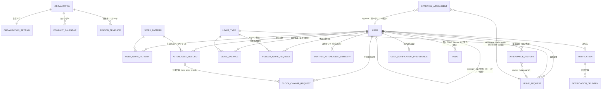
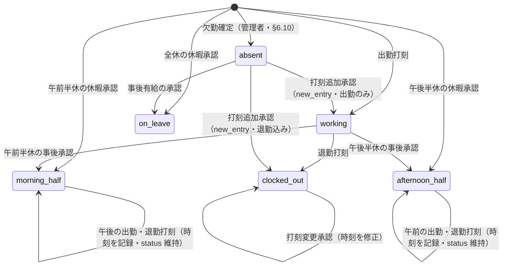
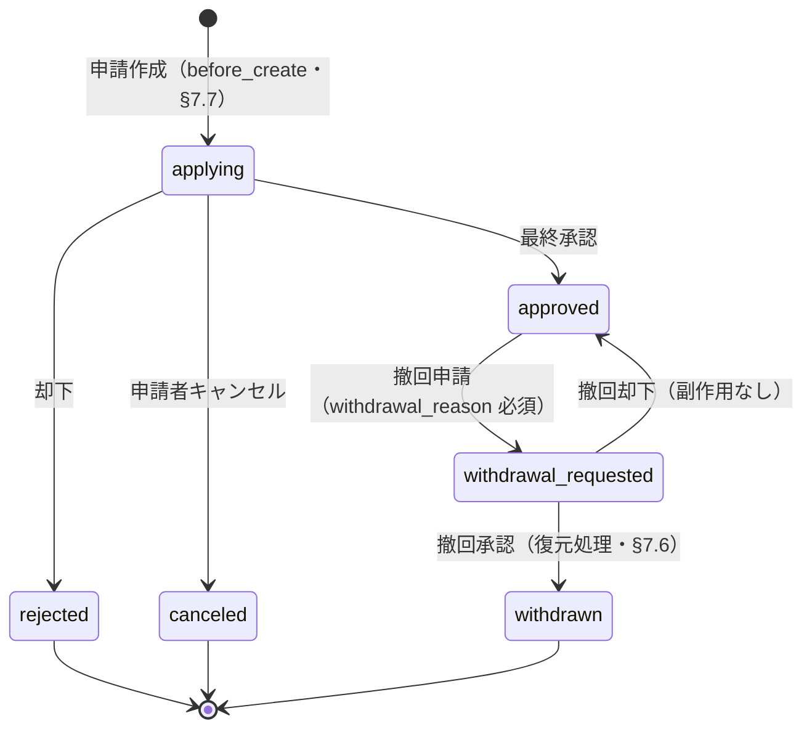
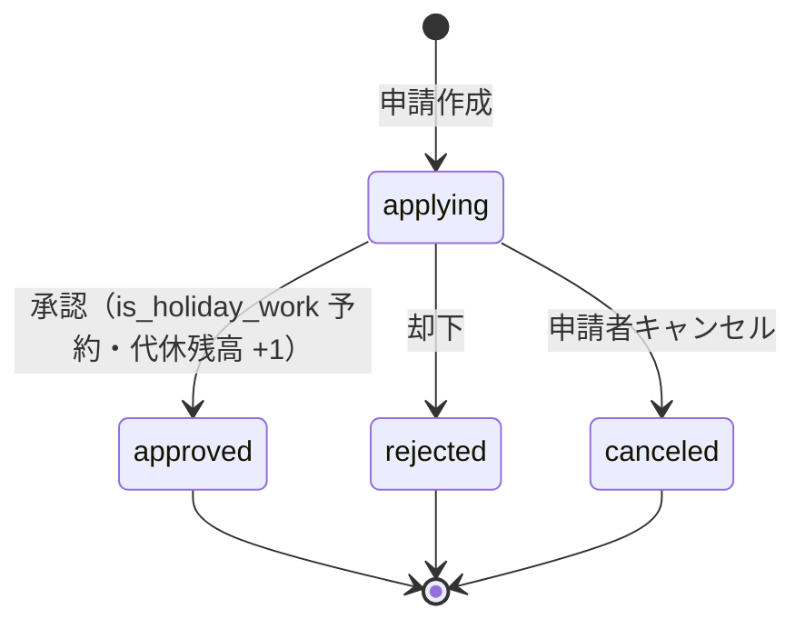
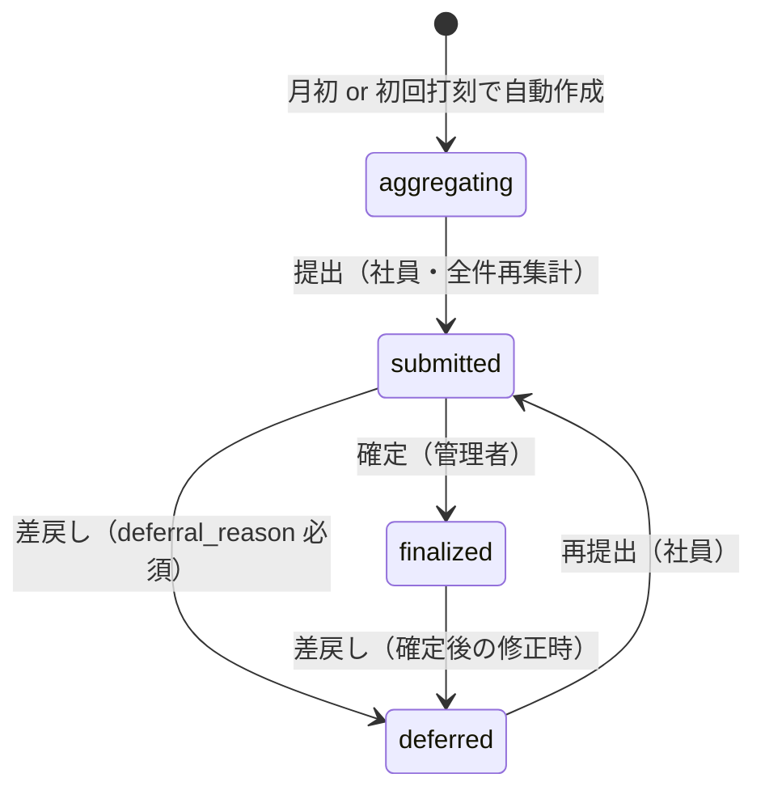

# 勤怠管理 SaaS「Gatcha on Rails」仕様書

> **由来:** 本仕様は Salesforce 上で稼働していた勤怠管理パッケージ「Gatcha」のドメインロジックを、Ruby on Rails 向けに再設計したもの。本書は移植元の知識なしで自立して読める。移植時の概念対応・引き継いだ設計判断の記録は [docs/MIGRATION_FROM_SF.md](MIGRATION_FROM_SF.md)（歴史的経緯・参照任意）。
>
> **作成日:** 2026-06-09 / **対象 Rails:** 8.x / **対象 Ruby:** 3.3+

---

## 0. このドキュメントについて

### 0.1 スコープ

- **対象:** 勤怠管理ドメイン（出退勤・休暇・申請承認・月次締め・労務コンプライアンス）
- **対象外:** 工数管理（日報・人員配置・予実・SES 精算）= 姉妹プロダクト「Gatcha Work」の領域。別サイクルで設計する。本仕様では「連携の継ぎ目」（§14）のみ定義する
- **成果物:** 本仕様書（設計合意のための SSOT）。実装コードは本サイクルの対象外

### 0.2 非ゴール

- 給与計算そのもの（基本給・手当・控除・実支給額の算出）。本システムは**勤務実績データ**を提供し、給与システムへの CSV 連携までを担う（労基法 108 条の賃金台帳は給与システムの責務）
- 工数・契約・請求管理（Gatcha Work 領域）
- v1 では時間単位の有給取得（労基法 39 条 4 項）には非対応。データモデルは将来拡張可能な構造を保つ
- 多言語対応（v1 は日本語 UI のみ。Rails の i18n 基盤は既定のまま温存し、文言のハードコードは避ける）
- 課金・契約・プラン管理（テナント開設は §16.7 の運用手順で代替）
- モバイルネイティブアプリ（レスポンシブ + PWA まで・§12.4）
- セルフサービスのテナント登録（公開サインアップ画面は作らない。§16.7）

### 0.3 用語集

定義の正本は各セクションの本文にある。本表は初読時の道標（要約 + 参照先）であり、本文と齟齬がある場合は本文が優先する。

| 用語 | 要約 | 正本 |
|------|------|------|
| テナント | 導入企業 1 社 = `Organization`。全データは行レベルで分離される | §3.1 |
| 打刻 | 出勤・退勤の時刻記録。`AttendanceRecord` を作成/更新する | §6.1 |
| 締め | 月次勤怠の提出 → 確定プロセス。確定月は編集ロック | §6.6 |
| 月次サマリ | 月単位の集計確定値（`MonthlyAttendanceSummary`）。永久保持で長期参照の基点 | §4.13 |
| 半休 | 午前半休 / 午後半休。所定労働の半分を休む（時間単位有給とは別物・v1 非対応） | §6.2 |
| 欠勤確定 | 無打刻・無申請の日を管理者が欠勤として確定する操作 | §6.10 |
| 代理打刻 | 管理者が対象社員に代わって行う打刻。承認不要・履歴記録必須 | §6.1 |
| 取消（キャンセル） | **承認前**の申請を申請者自身が取り下げること（終端） | §13.2 |
| 撤回 | **承認済み**の申請を取り消すこと。管理者の承認と状態復元処理を伴う | §7.6 |
| 二重 opt-in | 組織設定と個人設定の両方が ON のときだけメール通知を送る方式 | §9.4 |
| 法定休日 / 所定休日 | 法定休日 = 労基法 35 条の週 1 日（労働は 35% 割増・60h カウント外）。所定休日 = 会社が定めるその他の休日（土曜等） | §4.7 |
| 法定残業 / 所定外残業 | 法定残業 = 実労働 − 8h（労基法 32 条・割増とコンプラ判定の基準）。所定外残業 = 退勤 − 所定終業（表示用に併存） | §5.2 |
| 振替休日 / 代休 | 振替 = **事前**に休日を別日へ振替（同一週内なら割増不要）。代休 = 休日出勤の**事後**の休み（35% 割増は消滅しない） | §6.11 |
| 管理監督者 | 労基法 41 条 2 号の地位（`exempt_from_overtime`）。残業割増の対象外だが**深夜割増と面談対象からは除外されない**。`manager` ロール（システム権限）とは別概念 | §3.3・§8.3 |
| 36 協定 / 特別条項 | 時間外労働の労使協定。通常 月 45h/年 360h、特別条項でも 月 100h 未満・年 720h・2–6 ヶ月平均 80h が法定上限 | §8.2 |
| 勤務間インターバル | 前日退勤から当日出勤までの休息時間（既定 11h）。不足は警告・記録（打刻はブロックしない） | §6.9 |
| 深夜労働 | 22:00〜翌 5:00 の労働。全労働者に 25% 割増（管理監督者も対象） | §5.3 |
| 有給 5 日取得義務 | 年 10 日以上付与の労働者に付与日から 1 年で 5 日の取得を課す義務（違反は 1 人 30 万円以下の罰金） | §8.6 |
| 産業医面談 | 月 80h 超の時間外労働者への面談機会の提供義務（労安法 66 条の 8）。本人の申出が起点 | §8.7 |

---

## 1. 製品概要

日本の労働基準法・労働安全衛生法に準拠したマルチテナント型勤怠管理 SaaS。複数企業（テナント）が 1 つの Rails アプリを共有し、各社の社員が打刻・休暇申請を行い、管理者が承認・締め・コンプライアンス監視を行う。

### 1.1 主要機能（社員向け）

- 出退勤の打刻（モバイル対応・レスポンシブ / PWA）
- 有給・半休・各種休暇の申請
- 打刻時刻の変更依頼・休日出勤の事前申請
- 月次勤怠レポートの確認・提出・CSV エクスポート
- 個人 TODO・通知設定（オフタイム抑制）

### 1.2 主要機能（管理者向け）

- 部下の勤怠の一覧管理（ダッシュボード）
- 申請の多段階承認（自作承認エンジン）
- 月次締め処理（提出 → 確定 / 差戻し）
- 異常検知アラート（打刻漏れ・過重労働・36 協定・有給 5 日未取得・勤務間インターバル・連続勤務）
- 代理打刻・欠勤確定・産業医面談記録
- マスタ管理（勤務パターン・休暇種別・会社カレンダー・パターン割当・休暇残高）

### 1.3 本システムの本質的価値

単なる打刻記録ではなく、**労働法令違反の予防装置**である。具体的には:

- **正確な割増賃金の根拠データ:** 法定残業 / 所定外残業の二系統、月 60 時間超 50%、深夜帯 25%、法定休日 35%、複合割増（加算方式）を漏れなく算出
- **法的義務の番人:** 有給 5 日取得義務（罰金 30 万円/人）、36 協定上限、勤務間インターバル、連続勤務上限、産業医面談機会の提供を監視・記録
- **完全な監査証跡:** 追記専用ログ（`AttendanceHistory`）で任意時点の勤怠状態を再現可能。労基署調査・5 年保持義務に対応

### 1.4 ユーザーストーリー動線マップ

「機能が存在するか」ではなく「**アクターが目的を端から端まで達成できる動線（起点 route + nav 入口）が通っているか**」の SSOT。技術仕様（§4 データモデル／§5 計算）が捉えない「到達性」を一覧で検証する。各機能スライスは本表に自分の行を追加・更新してからマージする（DoD・§15／DEVELOPMENT_WORKFLOW）。

**状態凡例**: ✅ 端から端まで到達可能 ／ ⚠️ 部分（導線はあるが表示等に欠け） ／ — Phase 4+ 予定（行は実装スライスで追加）

| アクター | 目的（〜したい） | 起点 route | nav 入口 | 結果（副作用） | 状態 | §ref |
|---|---|---|---|---|:--:|---|
| 社員 | 出退勤を打刻し当日の状態を見たい | `/`（home） | ナビ「ホーム」/ 打刻ボタン | AR clock_in/out・計算 8 列 | ⚠️ | §6.1/§12.1 |
| 社員 | 休暇を申請し残高を見て反映させたい | `/leave_requests/new` | ナビ「休暇申請」 | 承認後 AR on_leave/半休・残高消費 | ✅ | §6.2 |
| 社員 | 打刻ミスを打刻変更申請で直したい | `/clock_change_requests/new` | ナビ「打刻変更」+ ホーム注記 | 承認後 時刻更新・§5 再計算 | ✅ | §6.3 |
| 社員 | 休日出勤を申請し代休を得たい | `/holiday_work_requests/new` | ナビ「休日出勤」 | 承認後 is_holiday_work・代休 +1 | ✅ | §6.11 |
| 社員 | 承認済み申請を撤回したい | 各 index 行内フォーム | ナビ「休暇申請」「打刻変更」 | 逆操作（残高/記録復元） | ✅ | §7.6 |
| 社員 | 自分の月次サマリを提出したい | `/monthly_attendance_summaries/:id` | ナビ「月次サマリ」→ 詳細 | submit 遷移 | ✅ | §6.6 |
| 社員 | 通知を確認し既読にしたい | `/notifications` | ナビ 🔔ベル →「すべての通知」 | 通知一覧・既読 flagging | ✅ | §4.18 |
| 社員 | 通知設定（抑制・メール opt-in）を変更したい | `/notification_preferences/edit` | ナビ 🔔ベル →「通知設定」 | quiet_hours / email_enabled 更新 | ✅ | §4.15/§4.17 |
| 管理者 | 申請を承認/却下したい | `/approval_assignments` | ナビ「承認」 | AASM 遷移 + 副作用 | ✅ | §7 |
| 管理者 | 部下の締めを確定/差戻ししたい | `/monthly_attendance_summaries/:id` | ナビ「月次サマリ」→ 詳細 | finalize/defer | ✅ | §6.6 |
| 管理者 | 月次サマリを一括確定したい | `/monthly_attendance_summaries`（bulk_finalize） | ナビ「月次サマリ」→ 一括 | BulkFinalizeJob（冪等） | ✅ | §6.6 |
| 管理者 | 代理打刻したい | `/proxy_clockings` | ナビ「代理打刻」 | 代理 AR・AttendanceHistory | ✅ | §6.1 |
| hr_admin | 各マスタを整備したい | `/admin/*` | ナビ「管理」→ 各タブ | マスタ CRUD | ✅ | §0b/§12.3 |
| hr_admin | パターン割当・残高を付与/編集したい | `/admin/users/:id`（nested） | 管理 → 社員 → 割当/残高 | UserWorkPattern/LeaveBalance CRUD | ✅ | §4.6/§4.10 |
| 給与担当 | 月次/日別 CSV を DL したい | `/monthly_attendance_summaries`（`summary_csv`/`detail_csv`） | ナビ「月次サマリ」→ DL | UTF-8 BOM CSV 出力 | ✅ | §6.4 |

> **アクター注**: 「給与担当」は専用ロールでなく、CSV を扱う hr_admin・manager の通称。
> **既知の部分断絶（⚠️）**: 社員ホームは打刻状態とカレンダー色のみで、§12.1 が想定する「当日の実労働/残業の数値」「申請ステータス・休暇残高サマリ」が未描画（1-1 最小出荷の残り）。Phase 4-1 通知基盤・ホーム拡充で解消予定。
> **不変条件**: `状態` が `✅` の行は「起点 route が実在し、nav 入口（または明示された画面内導線）からクリック到達でき、結果まで一周する」こと。空の `起点 route`／欠落 `nav 入口` は未検出の断絶の疑い＝レビュー指摘対象。

---

## 2. アーキテクチャ

### 2.1 技術スタック

| 層 | 採用技術 | 備考 |
|----|---------|------|
| 言語 / FW | Ruby 3.3+ / Rails 8.x | モノリス |
| データベース | PostgreSQL 16+ | 行ロック（`FOR UPDATE`）・jsonb・生成列・パーティショニング |
| 認証 | Devise | `User` モデル |
| マルチテナント | acts_as_tenant | 行レベル分離・`organization_id`・`validates_uniqueness_to_tenant` |
| 認可 | Pundit | ロール × テナントスコープのポリシー |
| フロントエンド | Hotwire（Turbo + Stimulus）+ ViewComponent + Tailwind CSS | サーバーレンダリング・レスポンシブ / PWA |
| リアルタイム | Action Cable（SolidCable）+ Turbo Streams | ベル通知 |
| バックグラウンドジョブ | Active Job + **SolidQueue** | `config/recurring.yml` で日次/週次/月次バッチ |
| メール | Action Mailer（`deliver_later`） | 二重 opt-in |
| 状態機械 | AASM | 申請承認・月次締めの状態遷移 |
| CSV | Ruby 標準 `CSV`（ストリーミング応答） | UTF-8 BOM 付・CRLF・RFC 4180 |
| テスト | RSpec + FactoryBot + Capybara | 計算オブジェクトは純粋単体テスト |
| 認可テスト | pundit-matchers | ポリシー網羅 |

### 2.2 設計原則

1. **計算ロジックは純粋オブジェクトへ分離する。** 労働時間・残業・深夜・遅刻早退の計算は `app/calculators/` 配下の AR 非依存な PORO（Plain Old Ruby Object）に切り出す。引数は値（時刻・分・パターン）、戻り値は値。これにより DB なしで網羅的な単体テストが書ける（労務計算は誤実装が法令違反に直結するため、検証容易性を最優先する）。
2. **複雑な業務ロジックは Service Object へ。** 「休暇承認」「撤回復元」「月次再集計」のような多段の副作用を伴う処理は `app/services/` のサービスクラスにまとめ、トランザクション境界を明示する。軽微な値セット（所有者 `user_id` の既定セット〔§3.5〕・初期ステータス）のみ AR コールバックを使う。
3. **状態遷移は AASM で宣言的に。** 申請の承認ステータス・月次締めステータスを AASM で定義し、遷移時フック（`after`）で副作用サービスを呼ぶ。状態遷移の全体像は §13 に図示し、AASM 定義と 1 対 1 に対応させる。
4. **認可は Pundit に一元化。** 認可判定は「**テナントスコープ（acts_as_tenant）+ Pundit ポリシー**」の 2 層に集約し、それ以外の独自認可層を作らない。
5. **過剰な防御・最適化コードを書かない。** 再帰ガードや無条件の一括化強制のような「制約ありき」の防御パターンを常用せず、大量処理は `find_each` / `insert_all` / `upsert_all` を「必要な箇所だけ」選ぶ設計判断とする。
6. **マルチテナント安全性をデフォルトに。** 全ドメインモデルに `acts_as_tenant(:organization)` を付与（テナントルートの `Organization` 自身は対象外）。`ApplicationController` で `set_current_tenant_through_filter` によりリクエストごとのテナントを確定する。ただし**リクエスト文脈を持たない経路**（SolidQueue ジョブ・自己参照 FK 代入・Devise のメール起点フロー）は自動スコープが効かないため、§3.6 の明示防御を必須とする。`ActsAsTenant.configure { |c| c.require_tenant = true }` でテナント未設定クエリを例外化し、ラップ漏れを構造的に検出する。

### 2.3 ディレクトリ構成（主要部）

```text
app/
├── models/            # ActiveRecord モデル（全モデルに acts_as_tenant）
├── calculators/       # 純粋計算オブジェクト（労働時間・残業・深夜・遅刻早退）
│   ├── scheduled_window.rb        # 入力合成（TZ 合成・夜勤 +1.day・日跨ぎコア）
│   ├── minute_conversion.rb       # 丸め規則の単一ソース（秒→分 floor・分→時 HALF_UP）
│   ├── work_time_calculator.rb
│   ├── overtime_calculator.rb
│   ├── deep_night_calculator.rb
│   ├── late_early_calculator.rb
│   └── leave_days_calculator.rb
├── services/          # 副作用を伴う業務ロジック（承認・撤回・再集計・代理打刻・欠勤確定）
├── policies/          # Pundit ポリシー（ロール × 所有 × テナント）
├── components/        # ViewComponent（ダッシュボード・カレンダー・申請フォーム）
├── jobs/              # Active Job（日次/週次/月次バッチ・通知配信）
├── mailers/           # Action Mailer
└── controllers/
config/
└── recurring.yml      # SolidQueue 定期ジョブ定義
```

### 2.4 名前空間（ドメイン分割）

モデル・サービスは以下のドメイン概念で整理する（物理的な module 名前空間は実装時に判断。本仕様は概念的グルーピング）:

| ドメイン | 含むもの |
|---------|---------|
| **Identity** | Organization, User, ロール, 上長階層 |
| **Masters** | WorkPattern, LeaveType, CompanyCalendar, UserWorkPattern, OrganizationSetting, ReasonTemplate |
| **Attendance** | AttendanceRecord, 計算オブジェクト群 |
| **Leave** | LeaveRequest, LeaveBalance, 有給 5 日義務 |
| **Requests & Approval** | ClockChangeRequest, HolidayWorkRequest, 承認エンジン, 撤回フロー |
| **Closing** | MonthlyAttendanceSummary, 締め状態機械 |
| **Compliance** | 36 協定, 勤務間インターバル, 連続勤務, 産業医面談, 打刻漏れ/欠勤検知 |
| **Notification** | Notification, NotificationDelivery, 抑制設定, 優先度 |
| **Audit** | AttendanceHistory, 保持/アーカイブ |
| **Integration** | ドメインイベント / Outbox（Gatcha Work 連携の継ぎ目） |

---

## 3. マルチテナント・認証・認可（Rails で新規構築）

> 認証・認可・テナント分離はフレームワークが「タダ」では提供しない自前構築領域であり、誤りが即データ漏洩につながる。本仕様で最も精密に定義するセクション。

### 3.1 テナントモデル

- **テナント = `Organization`**（導入企業 1 社）。全ドメインモデルが `belongs_to :organization` を持ち、`acts_as_tenant(:organization)` でスコープされる。**`Organization` 自身はテナントルートゆえ `acts_as_tenant` を付けない**。`subdomain` は*グローバル*ユニーク（テナントスコープ外の唯一の一意制約）。
- **テナント解決の順序（fail-closed）:** ①サブドメイン解決（`acme.gatcha.example.com` → `Organization.find_by(subdomain: 'acme')`）→ ②認証 → ③**整合突合**（`ActsAsTenant.current_tenant.id == current_user.organization_id`、不一致は即サインアウト + 401）。解決失敗・`active=false` 組織は 404 で打ち切り、**`current_tenant` が `nil` のまま処理を続行しない**。
- **一意性制約:** テナント内一意は `validates_uniqueness_to_tenant`（例: 社員番号、メール（§3.2）、同一ユーザー・年度・休暇種別の `LeaveBalance`）。
- **DB 制約:** クロステナント漏洩の最終防衛として、複合ユニークインデックスに必ず `organization_id` を含める。外部キーも `(organization_id, ...)` で整合を担保（自己参照 FK の同一テナント強制は §3.6 参照）。

```ruby
class AttendanceRecord < ApplicationRecord
  acts_as_tenant(:organization)
  validates_uniqueness_to_tenant :work_date, scope: :user_id
end
```

### 3.2 認証（Devise）

- `User` モデルに Devise（`database_authenticatable`, `recoverable`, `rememberable`, `validatable`, `lockable`, `trackable`, `timeoutable`）。
- `User belongs_to :organization`。1 社員 = 1 組織（複数組織所属は YAGNI として非対応。将来必要なら `Membership` 中間モデルへ拡張）。
- **メール一意性のテナントスコープ化（重要）:** メールは*テナント内*一意（別テナントで同一メール可）。Devise 既定のグローバル一意前提と衝突するため必須の手当て: (1) `User` の email インデックスはグローバル unique を撤去し `(organization_id, email)` 複合 unique に置換、(2) 認証クエリ（`find_for_database_authentication`）をテナントスコープ化、(3) パスワードリセット・ロック解除トークンはトークン列のグローバル unique を維持しつつ、メールリンクに**必ずサブドメインを含めて**テナントを再確定する（`recoverable`/`lockable`/`rememberable` の各経路で再確定を通す）。これを怠ると #2 の不整合セッションや、同一メール複数テナント時のトークン発行先不定が発生する。
- **将来拡張:** 企業の IdP 連携（SAML / OIDC）は OmniAuth で後付け可能な構造を保つ（v1 はパスワード認証のみ）。

### 3.3 ロールと上長階層

ロール・管理監督者・上長階層は以下の 3 要素で表現する:

| 要素 | 表現 | 役割 |
|------|------|------|
| ロール | `role` enum（employee / manager / hr_admin） | システム権限（閲覧・操作の範囲） |
| 管理監督者 | `exempt_from_overtime`（boolean）・`User#manager_supervisor?` | 労基法 41 条 2 号の労働法上の地位（割増計算の分岐） |
| 上長階層 | `User belongs_to :manager, class_name: 'User'`（自己参照 `manager_id`） | 承認ルート解決・上長への可視性 |

> **重要な区別:** `role`（システム権限：閲覧・操作の範囲）と `exempt_from_overtime`（**管理監督者**：割増賃金の適用除外＝労基法 41 条 2 号の労働法上の地位）は**別概念**であり、独立したカラムとして分離する。「manager ロールだから管理監督者」という混同は割増賃金の誤計算（未払い）に直結する。

- `role`: `enum role: { employee: 0, manager: 1, hr_admin: 2 }`
- `manager_id`: 直属上長。承認ルート解決と上長への可視性に使用
- `exempt_from_overtime`: 管理監督者フラグ。割増賃金・60h・法定休日・36 協定の計算で除外（深夜割増は**除外しない**。§8.3 参照）

### 3.4 認可（Pundit）

認可は **2 層**で構成する:

1. **テナント層:** `acts_as_tenant` が `organization_id` で全クエリを自動スコープ（他社データは構造的に不可視）
2. **認可層:** Pundit ポリシーで「ロール × 所有 × 上長関係」を判定

| 操作 | ポリシー判定 |
|------|------------|
| 自分の勤怠の参照 | `record.user == user` |
| 部下の勤怠の参照 | `record.user.manager == user`（または上長階層を辿る `user.subordinate_of?(record.user)`） |
| 部下の申請の承認 | `manager?` かつ承認ルート上の承認者 かつ `record.user != user`（自己承認防止） |
| マスタ管理 | `hr_admin?` |
| 代理打刻 | `manager?`（直接部下）または `hr_admin?`（全員） |

- **`scope`:** 一覧系は `Pundit::Scope` で「自分 + 部下」に絞る。**一覧・一括・CSV エクスポート系は生 `where` を禁止し `policy_scope` 起点とする**。`params[:user_id]` 等の対象指定は scope に対する `find` で解決し、scope 外は 404（IDOR 対策）。代理打刻・欠勤確定・月次一括確定も対象集合を scope で固定する。
- **Pundit の強制:** `ApplicationController` で `after_action :verify_authorized` をデフォルト ON とし、明示 skip のみ列挙する。2 層防衛ゆえポリシー網羅漏れ＝即バイパスとなるため、強制フックを必須とする。`verify_policy_scoped` は **index アクション限定**で強制する（Rails 7.1 `raise_on_missing_callback_actions` が show/update 等の非 index で誤 FAIL するため）。非 index の一覧・CSV・一括（`summary_csv` / `detail_csv` / `bulk_finalize` 等）は**手動 `policy_scope` 起点**で同等に担保する（実装裏取り済・Phase 3 spec-check）。
- **自己承認防止:** §7.3 参照（申請者＝承認者の直接ケースに加え、代理承認の循環・第 1=第 2 段階同一・撤回承認にも適用）。

### 3.5 オーナーシップ（当事者アクセスの担保）

「当事者が自分のレコードを見られる」ことは **`user_id`（対象社員の外部キー）+ Pundit スコープ**で表現する。代理打刻・バッチ生成でも `user_id` は必ず対象社員にセットし、操作者は `AttendanceHistory` 側に別途記録する（オーナーと操作者の分離）。

### 3.6 リクエスト文脈を持たない経路のテナント保証（最重要）

自動スコープ（`acts_as_tenant` + `set_current_tenant_through_filter`）が効くのは**リクエスト経路だけ**。以下 3 経路は自動スコープが効かず、明示防御が必須:

**(1) バックグラウンドジョブ（SolidQueue）:** 定期ジョブ（§10）はリクエストが無く `current_tenant = nil`。そのまま `find_each` すると全テナント横断になり、集計・打刻漏れ検知・通知が他社データを混入する重大事故になる。**全ジョブはテナントごとに実行する**:
- 定期ジョブは「ディスパッチャ」とし、`Organization.active.find_each { |org| TenantJob.perform_later(org.id) }` で子ジョブを enqueue（`Organization` はテナントルートゆえスコープ外で列挙可）
- 子ジョブ内は `ActsAsTenant.with_tenant(org) { ... }` でブロックスコープ
- `require_tenant = true`（§2.2-6）により、ラップ漏れは例外で即検出される

**(2) ユーザー間の自己参照 FK:** `manager_id`・`ApprovalAssignment.approver_id` 等は、`acts_as_tenant` の読み取りスコープでは*代入値*を検証できない。他テナントの `User.id` を（改竄 POST やシードバグで）代入できると、「部下の参照」認可を*通って*分離が破れる最悪パターンになる。**同一 `organization_id` をモデルバリデーションで強制**し、複合 FK `(organization_id, manager_id) → users(organization_id, id)` を DB 制約でも張る。承認者参照も同様。

**(3) Devise のメール起点フロー:** §3.2 参照（テナントスコープ化・複合 unique・リンクにサブドメイン）。

---

## 4. データモデル

**モデル関係の俯瞰（ER 図）。** 全ドメインモデルは `Organization` に `belongs_to` する（acts_as_tenant・§3.1）ため、図では Organization からの線を省略し、直接の親子として意味を持つ 3 本（OrganizationSetting / CompanyCalendar / ReasonTemplate）のみ描く:



polymorphic 関連（`ApprovalAssignment.approvable` / `AttendanceHistory.source`)は代表として LeaveRequest への線のみ描いているが、実際は ClockChangeRequest・HolidayWorkRequest（approvable）等にも張られる。

### 4.1 命名規約と共通方針

- カラム名は Rails 標準の snake_case（例: `clock_in`、`active`）。
- **全ドメインモデルに `organization_id`**（NOT NULL・FK・複合インデックス先頭）。
- 時刻はすべて `timestamptz`（UTC 保存）。**労働法判定はユーザー組織のタイムゾーン**（`Organization#time_zone`、既定 `Asia/Tokyo`）に変換してから行う。深夜帯判定・日付確定はこの変換が肝。
- 金額は扱わない。時間は分（整数）で中間計算し、最終表示・保存のみ時間単位（`decimal(6,2)`）。
- 導出値は算出メソッド or 生成列で表現する。**Postgres の STORED 生成列は同一行の immutable な算術のみ**（`CURRENT_DATE` 等の volatile 関数・他生成列参照は不可）。同一行算術（残日数等）は生成列可だが NULL 伝播を `COALESCE` で防ぐ。「期限超過」「あと何日」等の*時刻依存判定*は生成列にできず、算出メソッド or バッチ評価とする。

### 4.2 Organization（テナント・新規）

| カラム | 型 | 説明 |
|--------|-----|------|
| name | string | 企業名 |
| subdomain | string | テナント識別子（ユニーク） |
| time_zone | string | 既定 `Asia/Tokyo`。労働法判定の基準 TZ |
| fiscal_year_end_month | integer | 年度終了月（3 or 12 など） |
| active | boolean | 契約有効フラグ |

### 4.3 User（社員・新規 / Devise）

| カラム | 型 | 説明 |
|--------|-----|------|
| organization_id | bigint | テナント |
| email | string | ログイン ID（テナント内ユニーク） |
| encrypted_password 等 | — | Devise 標準 |
| name | string | 氏名 |
| employee_code | string | 社員番号（テナント内ユニーク） |
| role | integer (enum) | employee / manager / hr_admin |
| manager_id | bigint | 直属上長（自己参照 FK・null 可） |
| exempt_from_overtime | boolean | 管理監督者（労基法 41 条）。割増・36 協定から除外 |
| email_enabled | boolean | 個人メール通知 opt-in（既定 false） |

> **v2 送り:** 年少者深夜制限（労基法 61 条）用の `birth_date` は v2（§8.8 と同時）。v1 スキーマには持たない。
| active | boolean | 在籍フラグ（退職で false） |

> **退職処理:** `active=false` で論理退職。`UserWorkPattern` を無効化、`LeaveBalance` は退職後 5 年保持、`MonthlyAttendanceSummary` は永久保持（§11.2）。

### 4.4 WorkPattern（勤務パターン）

| カラム | 型 | 説明 |
|--------|-----|------|
| name | string | パターン名（日勤・夜勤・フレックス等） |
| start_time | time | 所定始業時刻 |
| end_time | time | 所定終業時刻 |
| break_minutes | integer | 所定休憩時間（分） |
| standard_work_hours | decimal | 1 日の所定労働時間 |
| night_shift | boolean | 日跨ぎ勤務（true: end_time を翌日換算） |
| flextime | boolean | フレックスタイム制 |
| core_time_start / core_time_end | time | フレックス時のコアタイム |
| morning_half_break_minutes | integer | 午前半休時の休憩（null 時は break_minutes/2） |
| afternoon_half_break_minutes | integer | 午後半休時の休憩（null 時は break_minutes/2） |
| active | boolean | 有効フラグ |

**法定休憩バリデーション（労基法 34 条 1 項）— モデルバリデーションで保存ブロック:**

| 所定労働時間 | 最低休憩 | エラー |
|-------------|---------|--------|
| 6h 超〜8h 以下 | 45 分 | 「6 時間超の勤務には 45 分以上の休憩が必要です（労基法 34 条）」 |
| 8h 超 | 60 分 | 「8 時間超の勤務には 60 分以上の休憩が必要です（労基法 34 条）」 |

半休用の休憩時間にも同様（半休の所定労働は `standard_work_hours / 2` で判定）。

> **実労働ベース再判定（原典照合 2026-06-13・労基法 34 条 1 項）:** 上記は WorkPattern マスタの**所定**労働時間に対する**最低保証**の事前検証である。34 条 1 項は「労働時間が 6 時間を**超える場合**…8 時間を**超える場合**」と**現に労働させた実労働時間**に応じて休憩を課す構造のため、所定 8h・休憩 45 分のパターンでも**実労働が 8h を超えた日は休憩 60 分が必要**になり、残業で不足が生じうる。当日の実労働で閾値を跨いだ日は不足を検知して**事後アラート**を出す（打刻ブロックはしない＝§8 原則。実装は §8・Phase 4 / 台帳 #8）。手待時間（客対応で離席不可の待機等）の労働時間性、および「残業何分で即 60 分か」の運用粒度は判例・行政解釈依存＝**社労士確認**（基発 401 号〔昭 22.11.27〕は MCP 原典未取得）。

**書き込み時の不変条件（0b-2 で追加）:** `flextime=true` は `core_time_start/end` 必須（§5.4 の遅刻早退判定がコアタイム基準のため）。コアタイムの順序は非夜勤では `core_time_start < core_time_end` を強制し、`night_shift=true` では日跨ぎコアタイム（start > end）を許容する（`start == end` の縮退は常時拒否）。`night_shift=false` は `start_time < end_time` 必須（§5.1 の翌日換算は night_shift かつ start > end が前提）。

`night_shift && flextime` の同時指定は**保存許可・警告バッジ表示**。優先ルール: 時刻計算は night_shift（翌日換算）、遅刻早退判定は flextime（コアタイム基準）。

### 4.5 LeaveType（休暇種別）

| カラム | 型 | 説明 |
|--------|-----|------|
| name | string | 種別名（有給・慶弔・産休・振替休日・代休等） |
| system_type | integer (enum) | annual / substitute_holiday / compensatory_leave / child_care / paternity_leave / other |
| allow_half_day | boolean | 半日取得可否 |
| paid_leave | boolean | 有給消化対象（残高から減算） |
| description | text | 説明 |
| active | boolean | 有効フラグ |

### 4.6 UserWorkPattern（パターン割当）

| カラム | 型 | 説明 |
|--------|-----|------|
| user_id / work_pattern_id | bigint | 割当先・パターン |
| start_date / end_date | date | 適用期間（end_date null = 無期限） |
| active | boolean | 有効フラグ（**誤登録の論理削除専用** — 正常な終了・切替は end_date で表現） |

**重複制約:** 同一ユーザーで有効な割当の日付範囲は重複不可（`end_date = null` は全未来日と重複扱い）。防衛は**モデルバリデーション + PostgreSQL exclusion constraint（btree_gist・`WHERE (active)`）の二重**（0b-4: Phase 1 の「有効な 1 件」取得が重複データで 2 件になると賃金計算の入力が非決定化するため DB 層を追加）。打刻時は「打刻日時点で有効な 1 件」を `start_date <= 当日 AND (end_date >= 当日 OR end_date IS NULL) AND active` で取得 — 述語の単一ソースは `UserWorkPattern.effective_on`。

**運用（0b-4）:** 割当は無効化のみ（destroy なし）。過去割当は未打刻日の所定根拠として温存する。今日以降も有効な割当が残る WorkPattern は無効化不可（先に割当を付け替える）。inactive な WorkPattern の新規割当・変更も拒否（無効化ガードの代入側対称）。「今日」の判定は組織 TZ（`Organization#today`）。

**将来拡張（v2・§8.8 と同期）:** 属人的法定制限の割当時警告 — 年少者×夜勤パターン（労基法 61 条 1 項）・flextime パターン×労使協定の対象労働者範囲（労基法 32 条の 3 第 1 項 1 号）。人×パターンの適法性検証は割当が結節点となる。

### 4.7 CompanyCalendar（会社カレンダー）

| カラム | 型 | 説明 |
|--------|-----|------|
| date | date | 対象日 |
| day_type | integer (enum) | weekday / saturday / sunday / holiday / company_holiday / legal_holiday |
| name | string | 祝日名・休業理由 |
| fiscal_year | string | 年度 |
| counts_as_paid_leave | boolean | 会社休業日を有給日数に含めるか |

**未登録日のフォールバック:** レコードがない日は ISO 曜日番号（ロケール非依存）で判定（月〜金=weekday、土=saturday、日=sunday）。共通ロジックは `CompanyCalendarResolver`（PORO）に集約。

**法定休日:** 就業規則で特定する。`legal_holiday` は `sunday` と排他。法定休日労働は 35% 割増対象で**月 60h カウントから除外**。

- **通達典拠（原典照合 2026-06-13）:** 労基法 35 条は法定休日の**曜日固定を要求しない**（1 項「毎週少くとも一回」・2 項「四週間を通じ四日以上」のみ）。**平成 6.1.4 基発第 1 号**は「35% 対象休日が就業規則等で**明確になっていることが望ましい**」とし、「休日のうち**最後の一回又は四日**について 35% を支払う旨を定めることは、上記休日を明確にしたものと認められる」とする（＜https://www.mhlw.go.jp/web/t_doc?dataId=00tb1911&dataType=1&pageNo=1＞）。週の起算は**別段の定めなき限り日曜〜土曜の暦週**（**昭和 63.1.1 基発第 1 号** ＜https://www.mhlw.go.jp/web/t_doc?dataId=00tb1899&dataType=1&pageNo=1＞）。
- **登録運用:** `legal_holiday` の登録を*必須運用*とする。
- **未特定時の扱い:** 一律 35%・曜日への自動降格（`sunday`）には**直行しない**（行政解釈・判例とも暦週内の休日配置から「最後の休日」を法定休日と推認する）。① 明示特定があればその日を 35% 計上 → ② 未特定なら暦週単位で休日配置から「最後の休日」を推認 → ③ **推認不能（履歴欠落・一括生成失効後など）は労働者有利に 35% を仮計上しつつ「要確認（高リスク）」アラートを発出**（25% フォールバックは割増の付け漏れ＝賃金未払リスクのため採らない）。失効時フォールバックは曜日（`sunday`）でなく**「要確認」状態**へ遷移させる（台帳 #11・ROADMAP 連動）。
- ※「特定なき場合は週の最後の休日」とする質疑応答の原典、および大阪地裁 2013.4.9 等の**裁判例は MCP 対象外**＝別途確認。**社労士確認推奨**。

**`counts_as_paid_leave`（会社休業日の有給扱い・原典照合 2026-06-13）:** `true` を許容してよいのは ① 計画的付与（**39 条 6 項**＝労使協定かつ**「5 日を超える部分」**に限る）② 労働者本人の請求 ③ 39 条 7 項の時季指定、のいずれか。**単なる使用者都合の休業は年休充当の領域でなく、労基法 26 条の休業手当（平均賃金の 100 分の 60 以上）**で処理する。①②（5 項・6 項取得）で消化した日は 39 条 8 項により 5 日取得義務（§8.6）にも算入できる。

**v1 の機能境界（0b-3）:** 本カレンダーは組織単位の単一マスタであり、シフト制・交替制の個人別法定休日は表現できない（v2 候補）。legal_holiday の「期間×曜日」一括登録は週休制（毎週特定曜日を法定休日と特定済み）専用 — 4 週 4 日制（労基法 35 条 2 項）の組織は CSV で個別登録する。

### 4.8 AttendanceRecord（勤怠記録）— ドメインの中核

| カラム | 型 | 説明 |
|--------|-----|------|
| user_id | bigint | 対象社員 |
| work_date | date | 勤務日（夜勤は出勤日で統一） |
| clock_in / clock_out | timestamptz | 打刻時刻 |
| work_pattern_id | bigint | **打刻時点で確定**したパターン（打刻後の割当変更は当日に影響しない） |
| actual_work_hours | decimal(6,2) | 実労働時間（退勤−出勤−休憩） |
| legal_overtime_hours | decimal(6,2) | 法定残業（実労働 − 8h。負は 0） |
| scheduled_overtime_hours | decimal(6,2) | 所定外残業（退勤−所定終業。負は 0） |
| deep_night_hours | decimal(6,2) | 深夜労働（22:00–05:00・休憩按分控除後。§5.3） |
| status | integer (enum) | working / clocked_out / morning_half / afternoon_half / on_leave / absent |
| leave_type_id | bigint | 休暇 status（morning_half / afternoon_half / on_leave）の休暇種別。複合 FK `(organization_id, leave_type_id) → leave_types` + CHECK（`leave_type_id IS NULL OR status IN (2,3,4)`）。月次集計の休暇内訳の素材（Phase 3-3a で追加・`LeaveRequests::ApplyApproval` が set / `Withdraw` が clear・§6.4） |
| is_late / is_early_leave | boolean | 遅刻・早退フラグ |
| late_minutes / early_leave_minutes | integer | 遅刻・早退分数 |
| is_holiday_work | boolean | 承認済み休日出勤日への打刻で true |
| absence_reason | integer (enum) | 欠勤確定時の理由（§6.10） |
| proxy_clock_reason | integer (enum) | 代理打刻時の理由（§6.1） |
| note | text | 備考（代理打刻・インターバル不足の自動追記先） |
| archived | boolean | アーカイブ済み（§11） |

> **計算列の方針:** `actual_work_hours` 等は**サービスで算出して保存**（打刻・打刻変更承認・休暇承認時に再計算）する「常時保存」運用。理由は CSV 出力・集計クエリでの再計算コストを避けるため。算出は §5 の計算オブジェクトに委譲。計算 8 列は **NULL = 未計算**（`Clockings::Recalculate` が一括書き込み — 一括 NULL / 一括非 NULL が不変条件。未計算の除外は `calculated` スコープ経由のみ・boolean の直接 where 禁止）。

### 4.9 LeaveRequest（休暇申請）

| カラム | 型 | 説明 |
|--------|-----|------|
| requester_id | bigint | 申請者 |
| leave_type_id | bigint | 休暇種別 |
| start_date / end_date | date | 期間 |
| half_day_type | integer (enum) | none / morning / afternoon |
| days_requested | decimal(6,2) | 取得日数（半休 0.5・土日祝除外で算出） |
| reason | text | 申請理由 |
| approval_status | integer (enum) | applying / approved / rejected / canceled / withdrawal_requested / withdrawn |
| withdrawal_reason | text | 撤回理由（撤回申請時必須） |
| last_stale_notified_on | date | 承認滞留アラートの重複防止 |

**半休排他:** `half_day_type != none` のとき `start_date == end_date` 必須。
**取得日数算出:** §5.5 `LeaveDaysCalculator`。

### 4.10 LeaveBalance（休暇残高）

| カラム | 型 | 説明 |
|--------|-----|------|
| user_id / leave_type_id | bigint | 対象 |
| fiscal_year | string | 年度 |
| granted_days | decimal | 当年度新規付与日数 |
| carry_over_days | decimal | 前年度繰越（年度更新ジョブが設定） |
| used_days | decimal | 使用済み（承認時に加算） |
| granted_on | date | 有給付与日（5 日義務の起点） |

- **残日数（算出）:** `granted_days + carry_over_days - used_days`。メソッド or STORED 生成列（生成列なら `COALESCE` で NULL 伝播を防ぐ）。
- **取得義務期限（算出）:** `granted_on + 365 日`。期限の*日付*は値だが、「**期限超過**」「あと何日」の判定は `CURRENT_DATE` 依存ゆえ生成列にできない（§4.1）。算出メソッド or 週次バッチで評価し、`granted_on` が NULL の残高は NULL safe に扱う。
- **同時実行制御:** 承認時は `LeaveBalance` を `lock!`（`FOR UPDATE`）で取得し、`used_days + days_requested > granted_days + carry_over_days` ならエラー（並行承認による残日数マイナス防止）。
- **繰越:** 年度更新時 `min(前年度残日数, organization_setting.carry_over_limit)` を翌年度 `carry_over_days` に設定。

### 4.11 ClockChangeRequest（打刻変更申請）

| カラム | 型 | 説明 |
|--------|-----|------|
| attendance_record_id | bigint | 対象記録（change_type=new_entry 時は null 可） |
| requester_id | bigint | 申請者 |
| change_type | integer (enum) | clock_in / clock_out / both / new_entry |
| target_date | date | new_entry 時必須（既存区分は記録から自動） |
| original_clock_in / original_clock_out | timestamptz | 変更前（競合チェック用） |
| new_clock_in / new_clock_out | timestamptz | 変更後 |
| reason | text | 変更理由（必須） |
| approval_status | integer (enum) | LeaveRequest と同じ 6 値 |
| withdrawal_reason | text | 撤回理由 |
| last_stale_notified_on | date | 滞留アラート重複防止 |

**new_entry:** 欠勤日（status=absent）への打刻追加に使用。全休日（on_leave）への追加は禁止（バリデーション）。半休日の追加は通常の変更申請で対応。
**競合チェック:** 承認時に `original_*` と現在の記録値を照合し、不一致なら承認エラー（§7.4）。

### 4.12 HolidayWorkRequest（休日出勤申請）

| カラム | 型 | 説明 |
|--------|-----|------|
| requester_id | bigint | 申請者 |
| work_date | date | 出勤予定日（カレンダーで平日以外のみ許可） |
| compensation_leave_type_id | bigint | 代償休暇種別（振替休日 or 代休の LeaveType） |
| reason | text | 出勤理由 |
| approval_status | integer (enum) | applying / approved / rejected / canceled |

**承認後の自動処理:** 当日の打刻に `is_holiday_work=true`、`compensation_leave_type` の `LeaveBalance.granted_days` を +1。未打刻のまま過去日になった場合は代休取消フロー（§6.11）。

### 4.13 MonthlyAttendanceSummary（月次サマリ）— 永久保持

| カラム | 型 | 説明 |
|--------|-----|------|
| user_id | bigint | 対象社員 |
| year_month | string | 対象年月（例 `2026-03`） |
| scheduled_work_days | integer | 所定出勤日数（カレンダーから） |
| work_days | integer | 実出勤日数 |
| total_work_hours / total_overtime_hours | decimal | 月合計。`total_overtime_hours` は**法定残業（legal）基準**で集計し、表示用の `overtime_calc_base` に依存しない（コンプラ判定の基準。§8 冒頭） |
| overtime_hours_over_60 | decimal | 月 60h 超残業（50% 対象。法定休日は含まない） |
| holiday_work_hours | decimal | 法定休日労働（35% 対象。60h カウント外） |
| total_deep_night_hours | decimal(7,2) | 月間深夜労働（月合計ゆえ日次 AR の (6,2) より 1 桁広い・schema 整合） |
| paid_leave_days_used | decimal | 有給使用日数 |
| absent_days / late_days / early_leave_days | integer | 欠勤・遅刻・早退回数 |
| total_leave_hours | decimal | 総休暇時間 |
| interval_violation_count | integer | 勤務間インターバル違反回数 |
| consecutive_work_days_max | integer | 最大連続勤務日数 |
| is_medical_guidance_target | boolean | 月残業 80h 超で自動セット |
| medical_guidance_on | date | 産業医面談実施日 |
| medical_guidance_note | string | 面談結果概要 |
| status | integer (enum) | aggregating / submitted / finalized / deferred（**「差戻し」の意**。「延期」ではない） |
| deferral_reason | text | 差戻し理由 |

> **長期参照の基点:** 月次集計・トレンドは必ず本モデルを基点にする（`AttendanceRecord` はアーカイブで消えうるが本モデルは永久保持）。

### 4.14 AttendanceHistory（監査証跡）— 追記専用

勤怠に関わる全イベントを前後値つきで完全記録する追記専用ログ。**作成後の不変性を三段で担保**する: (1) `readonly?` オーバーライド、(2) `before_update`/`before_destroy` で `raise ActiveRecord::ReadOnlyRecord`、(3) **DB レベルで UPDATE/DELETE を拒否**（トリガー or 権限 REVOKE）。アプリ層だけでは `update_all`/`delete_all`/raw SQL を素通しし、5 年の法的証跡（§1.3）が破れるため (3) を必須とする。

| カラム | 型 | 説明 |
|--------|-----|------|
| organization_id | bigint | テナント（付随テーブルにも `organization_id` を明示） |
| user_id | bigint | 対象社員（オーナー＝当事者・§3.5） |
| actor_id | bigint | 操作者（NULL=システム起因。代理打刻はオーナーと別人を記録・§3.5。`proxy_clock` では必須） |
| event_date | date | 対象勤務日 |
| event_type | integer (enum) | clock_in / clock_out / leave_approved / leave_withdrawn / clock_change_approved / absence_confirmed / absence_to_paid / proxy_clock / interval_shortage / clock_change_withdrawn |
| source_type / source_id | string / bigint | 起因レコード（polymorphic: LeaveRequest 等） |
| previous_status / new_status | integer | 前後の AttendanceRecord.status |
| previous_clock_in / new_clock_in | timestamptz | 前後の出勤時刻 |
| previous_clock_out / new_clock_out | timestamptz | 前後の退勤時刻 |
| previous_is_late / new_is_late | boolean | 前後の遅刻フラグ |
| previous_late_minutes / new_late_minutes | integer | 前後の遅刻分数 |
| previous_is_early_leave / new_is_early_leave | boolean | 前後の早退フラグ |
| previous_early_leave_minutes / new_early_leave_minutes | integer | 前後の早退分数 |
| note | text | 操作者情報・撤回理由等 |

> **設計意図:** 撤回時の状態復元はこのログを参照する（§7.6）。5 年保持（§11.2 の法的保存要件を自前で満たす）。
>
> **時刻の二軸:** `event_date`（対象勤務日）と `created_at`（操作時刻）は別物。同一勤務日に複数操作（代理打刻 → 後日の打刻変更等）が時系列で積まれるため、両軸を混同しない。
>
> **整数マッピングの凍結:** `event_type`（および `previous_status` / `new_status` に格納する `AttendanceRecord.status` の整数）は **append-only / 凍結**。値の追加は末尾のみ・既存値のリオーダや再利用は禁止する（過去ログの誤デコードを防ぐ）。
>
> **計算列を source にしない契約:** §7.6 の撤回復元はこのログの**前後値スナップショット**（`previous_*` / `new_*`）を参照するが、`proxy_clock` 行の計算列（`new_is_late` / `new_late_minutes` 等）は復元・賃金算定の source にしない。`proxy_clock` は新規作成（`previous_*` = NULL）であり、その計算列は記録時点の派生スナップショットにすぎない。確定値は常に `AttendanceRecord` から解決する（§11.1）。

### 4.15 OrganizationSetting（組織設定）

テナントごとに 1 行。key-value ではなく**バリデーション可能な型付きカラム**で構成する設定テーブル。管理者が管理画面から編集。

> **実装状況（0b-5）:** 実装済みカラムは `closing_day` / `submit_deadline_days` のみ。**残カラムは消費する Phase の PR が検証・既定値・意味論ごと同梱追加する**（ROADMAP 4-1 `email_enabled` 方式）。36 協定系 4 カラムは Phase 4-3 で法定定数モジュールと同一 PR（参考閾値 ≤ 法定の検証 + DB CHECK + 「ComplianceService が本テーブルを読まない」ガード spec を**必須同梱**。`alert_` リネームの要否のみそこで判断 — ROADMAP バックログ参照）。設定行の読み取りは **`Organization#setting` 経由のみ**（未生成なら既定値で lazy 生成 — §16.7-2 の「既定値で生成」はこのアクセサ + seeds が実装）。`fiscal_year_end_month` の変更は保存と同一 tx で既存 CompanyCalendar.fiscal_year を自動再計算する（対象は CompanyCalendar のみ。LeaveBalance / MonthlyAttendanceSummary 出現時は経過措置を再設計 — 社労士確認 #13・Phase 2-2 着手が再判断トリガー）。

| カラム | 型 | 既定 | 説明 |
|--------|-----|------|------|
| closing_day | integer | 31 | 締め日（31=月末） |
| submit_deadline_days | integer | 5 | 翌月の提出期限 |
| overtime_calc_base | integer (enum) | legal | 表示・集計の残業基準（legal / scheduled） |
| overtime_alert_threshold1/2/3 | integer | 45/80/100 | 残業アラート閾値 |
| carry_over_limit | integer | 20 | 有給繰越上限 |
| daily_batch_hour | integer | 2 | 日次バッチ実行時 |
| fiscal_year_end_month | integer | 3 | 年度終了月（**SSOT は §4.2 Organization**（DB 既定 3・NOT NULL）— 本テーブルでは保持しない。変更時は既存 CompanyCalendar.fiscal_year を同一 tx で自動再計算（0b-5 で確定・上記注記）） |
| leave_expiry_reminder_days | integer[] | [30,14] | 失効前リマインド（日前。配列で多段化） |
| quiet_hours_enabled | boolean | true | 通知抑制 ON/OFF |
| quiet_hours_start / quiet_hours_end | integer | 19 / 8 | 抑制時間帯 |
| holiday_block_enabled | boolean | true | 土日祝の通知ブロック |
| rest_interval_hours | integer | 11 | 勤務間インターバル閾値 |
| consecutive_work_day_limit | integer | 13 | 連続勤務アラート閾値 |
| email_notification_enabled | boolean | false | 組織メール通知（二重 opt-in の組織側） |
| annual_overtime_limit | integer | 360 | 36 協定・年間上限（通常） |
| annual_overtime_special_limit | integer | 720 | 年間上限（特別条項・違法ライン） |
| multi_month_average_limit | integer | 80 | 2–6 ヶ月平均上限 |
| monthly_over45h_limit_count | integer | 6 | 月 45h 超の年間許容回数 |
| stale_approval_days | integer | null | 承認滞留アラート日数 |

> **法定値は設定にしない（重要）:** 36 協定の上限（`annual_overtime_limit` 360 / `annual_overtime_special_limit` 720 / `multi_month_average_limit` 80 / `monthly_over45h_limit_count` 6）と割増判定の基準は**法定値であり、計算オブジェクト内の定数**とする（テナントが 720→800 等に改変できてはならない）。本テーブルに置く同名項目は*アラートの参考閾値*に留め、**コンプラ判定そのものには使わない**。`overtime_calc_base` は表示専用（§8 冒頭）。`daily_batch_hour` 等の運用値や v1 で誰も変えない項目は定数化 or 既定固定で足り、v1 の設定 UI からは絞ってよい（YAGNI）。

### 4.16 ReasonTemplate（申請理由テンプレート）

| カラム | 型 | 説明 |
|--------|-----|------|
| label | string | 管理用識別名 |
| template_text | string | 挿入テキスト |
| applies_to | integer (enum) | clock_change / leave / both |
| active | boolean | 有効フラグ |

### 4.17 UserNotificationPreference（ユーザー通知設定）

1 ユーザー 1 行（なければ OrganizationSetting にフォールバック）。

| カラム | 型 | 説明 |
|--------|-----|------|
| user_id | bigint | 対象（ユニーク） |
| quiet_hours_enabled | boolean | 個人の抑制 ON/OFF |
| quiet_hours_start / quiet_hours_end | integer | 個人の抑制時間帯 |
| holiday_block_enabled | boolean | 個人の休日ブロック |

> **email_enabled は本テーブルに持たない（4-1a で確定）:** 個人メール opt-in は `User.email_enabled`（§4.3）が SSOT。本テーブルは抑制系（quiet hours / 休日ブロック）のみを個人上書きとして持つ。組織フラグ `email_notification_enabled`（§4.15）との AND ゲートであり、組織設定への fallback を持つ抑制系とは意味論が異なるため分離する。

### 4.18 Notification / NotificationDelivery（通知）

通知は「**ベル通知（永続 + Turbo Streams）+ 配信ジョブ**」の 2 モデルで構成する。

**Notification（ベル通知の実体）:**

| カラム | 型 | 説明 |
|--------|-----|------|
| target_user_id | bigint | 通知先 |
| title / body | string / text | 内容 |
| priority | integer (enum) | action_required / informational / reference |
| source_type | integer (enum) | clock_out_forgotten / leave_expiry / overtime_alert 等 |
| subject_user_id | bigint | 通知対象者（重複制御キー） |
| read_at | timestamptz | 既読時刻 |

**NotificationDelivery（抑制キュー + メール配信状態）:**

| カラム | 型 | 説明 |
|--------|-----|------|
| notification_id | bigint | 親通知 |
| channel | integer (enum) | in_app / email |
| scheduled_at | timestamptz | 抑制終了後の送信予定時刻 |
| status | integer (enum) | pending / sent / error |
| retry_count | integer | 失敗リトライ（>3 で error 確定） |

> **責務の切り分け（重複回避）:** 遅延（オフタイム後送）と**リトライは SolidQueue を正**とする（`set(wait_until:)` + `retry_on`）。`NotificationDelivery` は状態を二重に持つ独立した状態機械にはせず、**送信結果の監査記録**（どの channel にいつ送ったか）に責務を限定する。in_app 通知は Turbo Streams で即時のため Delivery を介す必然は薄く、遅延・リトライ対象は実質 **email のみ**。`status`/`retry_count` は SolidQueue ジョブ結果の反映であって、SolidQueue と二重管理しない。

### 4.19 Todo（社員 TODO）

| カラム | 型 | 説明 |
|--------|-----|------|
| user_id | bigint | 所有者 |
| subject | string | タイトル |
| due_on | date | 期日 |
| completed | boolean | 完了フラグ |
| parent_id | bigint | 親タスク（自己参照・サブタスク） |

### 4.20 連携の継ぎ目（v1 は実装しない・§14）

Gatcha Work 連携用の Outbox（`IntegrationEvent`）は **v1 では作らない**。購読者（Gatcha Work）が範囲外で存在せず、「誰も読まないテーブルに溜めるだけ」になるため（YAGNI）。v1 は `AttendanceHistory`（`leave_approved`/`leave_withdrawn` を既に記録・§4.14）を将来の連携元データとし、承認・撤回サービスに *`after_commit` フック点*の位置だけを文書化して残す。実テーブル・配信ジョブは Gatcha Work 設計サイクルで追加する。詳細は §14。

---

## 5. 労働時間計算エンジン（純粋計算オブジェクト）

> 労働時間計算は AR 非依存の PORO に切り出す（§2.2-1）。入力は値、出力は値。DB なしで網羅的に単体テストする。各計算は**分単位（整数）で中間計算し、最終値のみ時間単位（`decimal(6,2)`）へ HALF_UP 変換**する（丸めルール統一）。すべての時刻比較は**組織 TZ へ変換後**に行う。
>
> **入力契約（重要）:** 計算オブジェクトには**組織 TZ に変換済みの `ActiveSupport::TimeWithZone`** を渡す（`clock_in`/`clock_out` は `in_time_zone(org.time_zone)` 変換、`WorkPattern` の `time` 型は当日日付 + 組織 TZ で合成）。夜勤の `end_time + 24h` は `time` の加算ではなく `Time.zone` 上の `+1.day` 合成で行う。コアタイムも同規則 — `night_shift=true` かつ `core_time_start > core_time_end` のときは `core_time_end` を翌日換算して合成する。**v1 は組織 TZ を `Asia/Tokyo` 固定（DST 無）**とし、任意 TZ 許容は将来課題（DST 跨ぎの深夜帯ずれを別途設計）。

> **秒の扱い（1-2 設計）:** 打刻は秒精度で保存（書き込み時に usec 切り詰め — `Clockings::ClockIn/ClockOut`）。分換算は「差分秒 ÷ 60 の整数除算（floor）」で統一。深夜 2 窓の重複は**秒で合算してから 1 回だけ floor**（窓ごと floor は労働者不利の追加切り捨てを生むため不可）。日次 floor の端数処理は社労士確認中（LABOR_LAW_REVIEW_NOTES #16）。

### 5.1 WorkTimeCalculator（実労働時間）

```
実労働時間 = 退勤時刻 − 出勤時刻 − 休憩時間
```

- 半休日の所定労働時間は `standard_work_hours / 2`
- 半休日の休憩: 午前半休は `morning_half_break_minutes`（null 時 `break_minutes/2`）、午後半休は `afternoon_half_break_minutes`（null 時 `break_minutes/2`）
- **夜勤（night_shift）:** `start_time > end_time` のとき `end_time` を翌日換算（+24h）。`work_date` は出勤日で統一

### 5.2 OvertimeCalculator（残業）

二系統を**常時**算出して保存:

```
法定残業 (legal_overtime_hours)     = max(0, 実労働時間 − 8h)   # 労基法 32 条 2 項「休憩時間を除き一日について八時間」
所定外残業 (scheduled_overtime_hours) = max(0, 退勤時刻 − 所定終業時刻)
```

> **8h は法定値固定**（480 分・テナント設定で改変不可・§8 原則）。所定基準の超過は scheduled 系統が担う。
> 旧式「実労働 − 所定」は §0.3 用語集・本節週 40h 注記（1 日 8h 超）と矛盾していたため補正
> （出典: <https://laws.e-gov.go.jp/law/322AC0000000049>・原典照合 2026-06-13・1-2 設計）。

- 表示・集計には `organization_setting.overtime_calc_base`（legal / scheduled）で使う値を切替（両方常時保存ゆえ過去再計算不要）。ただし**コンプラ判定（§8）は常に legal 基準固定**で `overtime_calc_base` に依存しない
- **週 40 時間超の法定時間外（労基法 32 条）:** 日次 `legal_overtime_hours`（1 日 8h 超）だけでは、所定 7h×6 日=週 42h のように*各日 8h 未満でも週 40h を超える*法定時間外を取りこぼす。割増 25% と 36 協定カウントに直結するため、**週単位の法定時間外（週の実労働 − 40h − 日次法定残業との重複分）を週次で算出**し月次に合算する。変形労働時間制は v2（清算期間での判定）。**社労士確認推奨**
- 月次の 60h 超・管理監督者除外・36 協定は §8 で集約

### 5.3 DeepNightCalculator（深夜労働 22:00–05:00 / 労基法 37 条 4 項）

**深夜帯定義:** `22:00:00` 〜翌 `05:00:00`。**22:00:00 ちょうどの退勤は含まない**（開始点）。22:00:01 以降は含む。05:00:00 で終了。

```
Step 1: 勤務帯 [clock_in, clock_out] と隣接 2 つの深夜帯の重複（overlap_minutes）を合算
        深夜帯 = [前日22:00, 当日05:00] と [当日22:00, 翌日05:00] の 2 窓（出勤日 D 基準）
        ※単窓 [D 22:00, D+1 05:00] のみでは早朝シフト（例: 4:00 出勤）の D 0:00〜5:00 帯を
          取りこぼす（労基法 37 条 4 項「午後十時から午前五時まで」— 1-1 設計レビューで補正）
Step 2: 休憩の按分控除
          deep_night_ratio = overlap_minutes / total_work_minutes
          deep_night_break  = FLOOR(break_minutes × deep_night_ratio)  # 切り捨て=労働者有利
Step 3: deep_night_hours = round((overlap_minutes − deep_night_break) / 60, 2, HALF_UP)
```

実装は `BigDecimal#round(2, half: :up)`。`total_work_minutes` は**退勤 − 出勤の gross 在席分（休憩込み）**（1-2 設計で明文化）。フレックス・変形労働でも**ロジック同一**（深夜割増は免除されない）。

### 5.4 LateEarlyCalculator（遅刻・早退判定）

**固定時間制（flextime=false）:**

- 遅刻: `clock_in > start_time` → `is_late=true`, `late_minutes` 算出
- 早退: `clock_out < end_time` → `is_early_leave=true`, `early_leave_minutes` 算出

**フレックス（flextime=true）:**

| 項目 | 判定 |
|------|------|
| 遅刻 | コアタイム開始前に出勤しているか（在席なら false） |
| 早退 | コアタイム終了前に退勤していないか（在席なら false） |
| 分数 | `late_minutes` / `early_leave_minutes` は **0 固定**（二値管理） |

**半休日（共通）:** 午前半休は終業側のみ判定（遅刻免除）、午後半休は始業側のみ判定（早退免除）。
**パターン未割当:** 判定スキップ + 管理者へ通知。

### 5.5 LeaveDaysCalculator（取得日数）

```
start_date〜end_date の全日から除外:
  - 所定休日に当たる曜日（既定は土・日。ただし土曜等を所定労働日として運用する組織では除外しない）
  - day_type = holiday
  - day_type = legal_holiday（法定休日は労働義務がなく年休を充当しない — 0b-3 設計レビュー反映。就業規則で日曜以外を法定休日とする組織で誤消化を防ぐ）
  - day_type = company_holiday かつ counts_as_paid_leave = false
残日数を合計（半休は 0.5）
```

申請フォームで Stimulus によりリアルタイム計算・表示（提出前に取得日数を確認）。

### 5.6 割増率の複合ルール（加算方式・参考）

計算エンジンは時間数を算出し、割増率の適用は給与システムの責務。ただし区分は CSV で提供:

| 区分 | 合計割増率 |
|------|----------|
| 法定残業（60h 以下） | 25% |
| 法定残業（60h 超） | **50%** |
| 法定休日労働 | 35% |
| 深夜のみ（所定内） | 25% |
| 法定残業 + 深夜 | 50% |
| 60h 超 + 深夜 | 75% |
| 法定休日 + 深夜 | 60% |

> 法定休日労働は 60h カウント外ゆえ「法定休日 + 深夜 + 60h 超」の三重複合は発生しない（上限 60%）。

---

## 6. 機能仕様

### 6.1 出退勤打刻

- Hotwire の「出勤 / 退勤」ボタン（Turbo + Stimulus）。モバイルは大きめ UI・PWA
- 打刻時に現在時刻を記録し `AttendanceRecord` を作成 / 更新
- **パターン確定:** 出勤打刻時に `UserWorkPattern` から有効な勤務パターンを引き、`attendance_record.work_pattern_id` に**スナップショット**。以後の割当変更は当日に影響しない（翌営業日から適用）
- **二重打刻防止:** 同日出勤済みなら出勤ボタンを Turbo で disable + 「すでに出勤済みです」。サーバー側でもバリデーション（モバイルのタップ遅延対策）
- **代理打刻（管理者）:** 対象社員を選び打刻。承認不要（権限行使として即時）。理由（`proxy_clock_reason`）選択必須
  - `note` に「代理打刻（出勤/退勤）：{操作者名} が {日時} に実施（理由: {reason}）」を自動追記（既存は `；` 連結）
  - `AttendanceHistory`（event_type: proxy_clock）に記録
  - 対象社員へ即時通知:「{管理者名} が代理で{出勤/退勤}打刻を実行しました。時刻が異なる場合は打刻変更申請を提出してください」

**proxy_clock_reason（enum）:** system_failure / unreachable / forgot_punch / other（「その他」でも自由入力欄は出さない＝§6.10 欠勤確定とは非対称）

### 6.2 休暇申請

- 社員が休暇種別を選び申請。半休可能種別で午前/午後半休を選択（半休は 1 日のみ）
- v1 は日単位・半日単位のみ（時間単位は v3）
- 複数日申請可（`days_requested` は §5.5 でリアルタイム算出）
- **残高 2 段階表示**（paid_leave 種別のみ）: 確定残高（承認済）と仮残高（申請中含む）。申請後残日数が **正→通常 / 0→アンバー + ℹ️「今年度の有給を使い切ります」/ 負→赤警告**。不足でも申請は通す（承認者が最終判断）。**ただし承認時は残高超過をハード拒否**する（`used_days + days_requested > granted_days + carry_over_days` で `lock!` 下にエラー・§4.10 同時実行制御）。残高不足の申請を承認するには hr_admin が事前に `LeaveBalance` を付与する（設計 2-2b D1・over-balance のサイレント計上を防ぐ）
- 理由欄に `ReasonTemplate`（applies_to: leave / both）をチップ表示
- **承認後の自動処理**（承認サービス、§7）: 対象日の `AttendanceRecord` 作成/更新（全休→on_leave、午前→morning_half、午後→afternoon_half）、打刻済なら遅刻早退フラグ再計算・上書き（午前半休→遅刻免除 / 午後半休→早退免除）、`LeaveBalance.used_days` 加算（`lock!`）、`AttendanceHistory`（leave_approved）記録（v1 はここまで。Gatcha Work 連携の publish は §14 の将来拡張点）
- **却下/取消:** `AttendanceHistory` に記録（連携 publish は §14 の将来拡張点）
- **欠勤後の事後有給:** 承認時に status を absent→on_leave へ上書き、`AttendanceHistory`（absence_to_paid）記録
- **月跨ぎ申請:** 1 件で申請・承認。集計は各日付の属する月に分割計上。締め済み月の日付が含まれる場合は**その月の日付のみブロック**し差戻しを促す（他月は正常進行）
- **年度跨ぎ申請:** `LeaveBalance` 加算は `start_date` の属する年度に統一（日割り分割しない）
- 締め済み月への申請は §6.7 の制限に従う

> **トランザクション境界:** 承認サービスは 1 トランザクションで実行する（大量日数時のみ `insert_all` でバルク化を選択）。将来の Gatcha Work 連携 publish は after_commit フック 1 点に差し込む（§14・v1 では実装しない）。

### 6.3 打刻時刻変更依頼

- 既存記録への出勤/退勤時刻変更（change_type: clock_in / clock_out / both）、欠勤日への新規打刻（new_entry）
- 理由必須・テンプレートチップ表示
- **承認時:** 競合チェック（§7.4）→ `AttendanceRecord` 時刻更新（or 新規）→ 実労働/残業/遅刻早退の再計算（§5）→ `AttendanceHistory`（clock_change_approved）記録
- 撤回時は履歴参照で復元（§7.6）

### 6.4 月次勤怠レポート

- 月単位のサマリ + 日別明細を Hotwire で表示（ViewComponent）
- **CSV エクスポート 2 種**（UTF-8 BOM 付・CRLF・RFC 4180・`YYYY-MM-DD` / `HH:MM` / 小数点ドット）:
  - **月次サマリ CSV:** **社員コード・氏名**・所定/実出勤日数・総労働/総残業・60h 超・法定休日・深夜・管理監督者フラグ・有給使用・遅刻早退・総休暇時間（社員識別子列で給与システムが行を社員に突合・Phase 3-3b で補充）
  - **日別明細 CSV:** 日付・出退勤・実労働・残業・深夜・遅刻早退・status（1 行=1 日）
  - 割増区分別（法定残業/60h 超/法定休日/深夜）を網羅し給与システム入力に不足なし
  - **CSV ≠ 賃金台帳:** 本 CSV は勤務実績データ。賃金台帳（基本給・手当・控除）は給与システムの責務
- **集計タイミング 2 種:**
  - **日次バッチ（前日分積み上げ）:** `daily_batch_hour` 時に前日分加算（月中は概算）
  - **提出時全件再集計:** 「提出」時に対象月を正確に再集計し確定値保存。対象月の `AttendanceRecord` を 1 クエリで取得し `MonthlySummaryService` で計算
- 提出前に退勤未入力日があれば警告（提出は可能）

### 6.5 残業時間自動計算

§5.2（算出）+ §8（月次の 60h 超・管理監督者・36 協定）に集約。退勤打刻・打刻変更承認・休暇承認時に再計算。

### 6.6 勤怠締めフロー（月次サマリ状態機械）

AASM で `MonthlyAttendanceSummary.status` を管理:

| 状態 | 社員操作 | 遷移 |
|------|---------|------|
| aggregating（集計中） | 打刻・申請すべて自由 | 提出 → submitted |
| submitted（提出済） | 打刻変更/休暇/撤回申請の**新規作成を制限** | 確定 → finalized / 差戻し → deferred |
| finalized（確定） | 全ロック | 差戻し → deferred |
| deferred（差戻し） | 制限解除・再度操作可 | 再提出 → submitted |

- **状態遷移はカスタム実装**（汎用の承認 gem の「却下＝終了」は「差戻し→修正→再提出」のループに不適合。AASM で素直に表現）
- **差戻し:** `deferral_reason` 必須・社員へ通知・「集計中」には戻さない
- **承認時の締めステータス再チェック:** 申請作成後に締めが submitted/finalized へ遷移した場合、承認操作時に再検証しロック中なら承認エラー（CCR / LR / HWR の全 3 種。§7）
- **提出前チェック:** 承認進行中（プロセス起動済み未完了）の申請があれば提出ボタン非活性 + 対象一覧表示。申請中（未起動）はキャンセルで提出可
- 編集制御はサーバー側バリデーション + UI（Turbo で disable）の二重
- **月次一括確定:** 複数社員分は SolidQueue ジョブで分割（応答性のためバックグラウンド化）

### 6.7 締めステータスによる申請制限（横断ルール）

submitted / finalized の月に属する日付に対し、CCR / LR / HWR の**新規作成を制限**。加えて **LR / CCR の撤回申請を制限**する（HWR は撤回フローを持たない＝§4.12・4 値）。修正は「管理者へ差戻し依頼 → deferred で操作 → 再提出」の通常フローに統一。実装は各申請モデルのバリデーション（対象日の月次サマリ status を参照）。

### 6.8 打刻漏れ検知（日次バッチ）

SolidQueue 定期ジョブ（毎日 `daily_batch_hour` 時）で前日分を検査:

**退勤打刻忘れ:**
```
(status ∈ {working, morning_half, afternoon_half}) AND clock_in IS NOT NULL AND clock_out IS NULL
```
`clock_in IS NOT NULL` で「休暇承認のみ・打刻なし」の誤検知を防ぐ。**夜勤者**（有効な `UserWorkPattern` の `work_pattern.night_shift=true`）はバッチ時点で勤務中の可能性があり対象外（翌日実行で検出）。回復は打刻変更申請（推奨）or 代理打刻。**前日以前の打刻忘れは打刻変更申請（§2-3）で回復する。代理打刻は当日（`organization.today`）のみ**（§6.1 の実装は対象日を当日に固定）。通知に「退勤時刻を申請する」リンク（1 タップで申請画面へ）。

**無打刻検知（2 カテゴリ・通知のみ。AttendanceRecord は作らない）:**

| カテゴリ | 条件 | 通知 |
|---------|------|------|
| 欠勤候補 | AttendanceRecord も LeaveRequest（全 status）も無 | 管理者 + **本人**へ通知 |
| 休暇申請中・打刻なし | AR 無・LeaveRequest（申請中/進行中）有 | 管理者へ通知 |

毎日実行（土日祝含む）。通知は**本人の次の稼働日**に送信。欠勤候補は本人へ事前通知:「{日付} の出勤記録がありません。打刻漏れなら打刻変更申請を（猶予: 翌営業日 17:00）」。猶予内に申請なければ管理者の「欠勤確定待ち」に表示。

### 6.9 勤務間インターバルチェック（§8.4 と連動）

出勤打刻時にリアルタイム判定。前日退勤と当日出勤の間隔が `rest_interval_hours`（既定 11）未満なら本人へ画面警告・管理者へ通知。`AttendanceRecord.note` に自動追記 + `interval_violation_count` インクリメント + `AttendanceHistory`（interval_shortage）記録。打刻はブロックしない。夜勤は翌々日の出勤で判定。

### 6.10 欠勤確定フロー

1. 日次バッチが欠勤候補を検知 → 管理者 + 本人へ通知
2. 猶予（翌営業日 17:00）経過後、管理者がダッシュボードの「欠勤候補一覧」を確認
3. 管理者が対象社員 × **1 件以上の日付**を選び、**欠勤理由**を入力して「欠勤確定」（1 操作 = 1 社員 × N 日付の一括確定）
4. `AttendanceRecord`（status: absent）を一括作成・`absence_reason` 記録、`AttendanceHistory`（absence_confirmed）を N 件記録
5. 対象社員へ通知（1 社員 × N 日付を 1 件に集約。複数日は「{日付列}（計 N 日）の欠勤が確定されました。事後の有給申請が可能です」）

**absence_reason（enum）:** unauthorized（無届）/ illness（疾病・傷病）/ family（家庭事情）/ investigating（打刻漏れ調査中）/ other。**other 選択時のみ** `note` 入力欄を表示（任意・空可）。other 以外は note=null。

**制限:** finalized 月への欠勤確定禁止（差戻し → 欠勤確定 → 再提出）。deferred 月は許可。

### 6.11 休日出勤フロー

1. 社員が `HolidayWorkRequest` を申請（出勤予定日・代償休暇種別・理由）。`work_date` はカレンダーで平日以外のみ（バリデーション）・同一日重複禁止
2. 承認（§7）後、当日打刻で `is_holiday_work=true` 自動セット
3. 承認時に `compensation_leave_type` の `LeaveBalance.granted_days` を +1
4. 社員は後日 LeaveRequest（振替休日 or 代休）で取得

**振替休日と代休の法的区別**（CSV 区分・給与影響）:

| | 振替休日 | 代休 |
|--|---------|------|
| 定義 | 事前に法定休日を別日へ振替 | 法定休日出勤後に別日を休暇 |
| 割増 | 同一週内なら割増不要 | 35% 割増は**消滅しない** |

> **事前特定の必須化（原典照合 2026-06-13）:** 労基法 35／36／37 条に「振替休日」「代休」の**明文規定はなく**、両者の区別は行政解釈・判例による（条文照合済 ＜https://laws.e-gov.go.jp/law/322AC0000000049＞）。割増賃金の支払義務が免除されるのは**あらかじめ特定の労働日と休日を振り替えた**場合に限られ、勤務日を交換せず後日休ませるだけの運用は法的に**代休（35% 割増は消滅しない）**と評価されるおそれがある。したがって `substitute_holiday`（振替休日）を選ぶ場合は **振替元休日・振替先労働日・承認日時の事前指定を必須**とし、未指定の運用は代休扱い（休日割増の計上対象）とする。※「事後の振替でも割増免除可」と読める解釈の可否、振替/代休の通達原文（昭 23.4.19 基発 69 号・昭 63.3.14 基発 150 号とされる＝ MCP 未取得）、ブルーハウス事件等の**裁判例は MCP 対象外**＝**社労士確認**。

**HWR 承認後に未打刻の場合:** 月次バッチで「承認済 × work_date 過去 × 当日 AR なし」を検出 → 管理者へ通知・「休日出勤未打刻」一覧表示 → 管理者が ①代休取消（`granted_days` −1 + 通知）②打刻追加（代理打刻）③保留 を選択。**月次確定前に必ず解消**（割増未記録なのに代休付与の不整合を防ぐ）。

---

## 7. 承認エンジン（自作）

> Rails には標準の承認機構がないため**自作**する。その分テナント別に柔軟・透明な承認フローを構築できる。

### 7.1 構成モデル

v1 は**設定可能なルートエンジンを作らない**（テナント別ルートの要求は v1 スコープに無く、`manager_id` 階層の固定 2 段で全要件を満たす＝YAGNI）。実行時の状態のみ記録する:

| モデル | 役割 |
|--------|------|
| **ApprovalAssignment** | 実行時。approvable（polymorphic）× position（1/2）× approver × decision（pending/approved/rejected）× acted_at × comment。`approver` は**同一テナント検証必須**（§3.6） |

`approval_status`（申請モデル側）は AASM で**業務ステータス**（applying / approved / rejected / canceled / withdrawal_requested / withdrawn）のみ保持。**段階情報**（第 1/第 2 段階待ち）は `ApprovalAssignment` 群から導出して表示。テナント別ルートのカスタマイズは v2 の拡張テーマ。

### 7.2 承認ルート解決（固定 2 段）

| 申請者 | ルート |
|--------|--------|
| `role: employee` | 第 1 段階: 直属上長（`manager_id`）→ 第 2 段階: 第 1 段階承認者の上長（部門長） |
| `role: manager` | 第 1 段階: 部門長 → 第 2 段階: 人事（hr_admin） |

- 承認者は `manager_id` 階層から導出（第 2 段階は第 1 段階承認者の `manager`）。階層が浅く**第 1 段階 = 第 2 段階が同一人物になる場合は単段に縮約**し、独立性が取れない旨を表示。`manager_id` 未設定の社員は申請不可（セットアップで必須）
- 承認者参照は**同一テナント**（§3.6）。ルート選択は申請者の `role` で排他的に決まる

### 7.3 自己承認防止

承認サービス（`ApprovalService#approve`）の冒頭 + Pundit ポリシーの二重で検証し、API・直接更新でもブロックする:

- **直接ケース:** `approver != approvable.requester`
- **代理承認:** 実際に decision を下す実 User（代理人含む）が requester でないこと。委任の循環（X→Y かつ Y が X 宛て申請に絡む）も拒否
- **段階独立性:** 第 1 段階と第 2 段階の approver が同一でないこと（§7.2 で同一なら単段縮約）
- **撤回承認にも適用:** 撤回の承認/却下にも `approver != requester` を課し、manager 本人が自分の申請の撤回を自己承認する経路を塞ぐ
- **AASM イベント経由のみ:** `approval_status` は AASM イベントでのみ更新し、`update_column`/`update_all` での直接代入を禁止（状態機械の迂回防止）

### 7.4 競合チェック（打刻変更）

CCR 承認時、`original_clock_in/out` と現在の `AttendanceRecord` 値を照合。不一致なら承認エラー + 承認者へ通知（「変更前時刻が現在の記録と一致しません」）。承認者は却下 or 申請者へ再申請を促す。

### 7.5 代理承認・滞留アラート

- **代理承認:** 承認者は自身の代理承認者を設定可能（`User` に `delegate_approver_id`、or 承認画面で委任）。承認者不在時に代理が承認できる
- **滞留アラート:** 承認待ちが `stale_approval_days` 超過で週次バッチが管理者の上長（manager の manager）へ通知。`last_stale_notified_on` で重複防止

### 7.6 撤回フロー（承認済の取消）

承認待ち中の取り下げ（取消 / canceled）とは別の、**承認済レコードの撤回**フロー:

| 操作 | 処理 |
|------|------|
| 撤回申請（申請者） | `withdrawal_reason` 必須 → status: withdrawal_requested → 管理者へ通知。`withdrawal_requested` 状態では承認イベントを**未定義**とし、承認エンジンの再起動を `InvalidTransition` で構造的に防ぐ（「ガード」ではなくイベント未定義で表現） |
| 撤回承認（管理者） | status: withdrawn → 復元処理（下記） |
| 撤回却下（管理者） | status: approved に戻す → 申請者へ却下理由通知 |

**LeaveRequest 撤回の復元処理:** `AttendanceHistory` を参照し対象日の `AttendanceRecord` を申請前状態へ復元、`LeaveBalance.used_days` 減算、`AttendanceHistory`（leave_withdrawn）記録（連携 publish は §14 の将来拡張点）。
**ClockChangeRequest 撤回の復元処理:** 履歴参照で打刻時刻を復元、各種再計算、`AttendanceHistory` 記録。
**制限:** submitted / finalized 月への撤回申請は §6.7 に従い制限。

> **撤回却下（→approved 復帰）では承認副作用を再発火させない。** AASM の `after` 副作用は**イベント単位**に紐付け、`reject_withdrawal`（approved へ戻す）には副作用を付けない（残高二重加算・履歴二重記録の防止）。詳細は §13。

### 7.7 申請の初期ステータス

`before_create` で `approval_status = applying` をセット（AASM 初期状態）。承認エンジンの起動はその後。

---

## 8. コンプライアンス監視（労務違反の予防装置）

> 月次・退勤時の各チェックは `ComplianceService` 群（PORO + サービス）に集約。**打刻のブロックは一切行わない**（労基法上、実労働時間の正確な記録義務がある。ブロックはサービス残業の温床となり法的リスクを増大させる）。違反は事後の管理者通知・人事エスカレーションで対応。
>
> **判定基準は法定（legal）固定:** §8 の全コンプラ判定（60h・36 協定・産業医面談）は**法定残業（`legal_overtime_hours`）基準**で行い、表示用の `overtime_calc_base`（legal/scheduled）には依存しない。36 協定の上限値・割増基準は法定値の**定数**（§4.15）であってテナント設定では改変しない。
>
> **典拠の階層（原典照合 2026-06-09 / 報告書原典再照合 2026-06-13・e-Gov）:** 数値の出典は法／政令／省令／通達に分かれる。実装時に意識すること——時間外 25%・深夜 25%・60h 超 50% ＝ **労基法 37 条 + 政令**、**法定休日 35% ＝ 政令**（「労働基準法第三十七条第一項の時間外及び休日の割増賃金に係る率の最低限度を定める政令」平成 6 年政令第 5 号・law_id 406CO0000000005。政令**本文の 35% 数値は MCP で本文取得不能** ＝ e-Gov 直接確認を要する）、**罰則は違反類型ごとに条文が異なる**——割増賃金未払（37 条）・36 協定上限違反（36 条 6 項）＝ **労基法 119 条**（6 月以下の拘禁刑 又は 30 万円以下の罰金）／年休 5 日付与義務違反（39 条 7 項）＝ **労基法 120 条**（30 万円以下の罰金・拘禁刑なし）、**産業医面談の月 80h・週 40h 超・本人申出 ＝ 安衛則 52 条の 2**（法 66 条の 8 は「省令で定める要件」と委任）、有給 5 日の「10 日以上」＝ 条文（39 条 7 項「使用者が与えなければならない…日数が十労働日以上」）どおり**新規付与基準を既定**とする（§8.6・二層管理。原典照合 2026-06-13）。解釈を要する項目は `docs/LABOR_LAW_REVIEW_NOTES.md`（社労士確認事項）を参照。

### 8.1 月 60 時間超残業（割増 50% / 2023 年 4 月〜全企業）

- **60h カウント対象:** `legal_overtime_hours` の月間累計。ただし**法定休日労働は除外**
- `overtime_hours_over_60 = max(0, 60h カウント対象 − 60)`
- 法定休日労働は `holiday_work_hours` として別集計（35% 対象・60h カウント外）
- 退勤打刻時に当月累積を計算し 60h 接近でアラート

### 8.2 36 協定の上限管理（労基法 36 条）

**法定上限:**

| 区分 | 上限 | 違反時 |
|------|------|--------|
| 通常 | 月 45h / 年 360h | 是正勧告 |
| 特別条項 | 月 100h 未満 / 年 720h / 2–6 ヶ月平均 80h 以下 | **罰則あり・労基法 119 条**（拘禁刑 6 月以下 or 罰金 30 万円以下） |
| 特別条項の回数 | 月 45h 超は年 6 回まで | 同上 |

**チェックロジック（月次バッチ + 退勤時即時）:**

```
月次（締め提出・確定時にも再検証）:
  yearly_total   = Σ total_overtime_hours WHERE fiscal_year = 当年度
  months_over_45 = COUNT WHERE total_overtime_hours > 45 AND fiscal_year = 当年度
  a. yearly_total > annual_overtime_limit(360)         → 管理者アラート
  b. yearly_total > annual_overtime_special_limit(720) → 管理者+人事エスカレーション（違法状態）
  c. months_over_45 > monthly_over45h_limit_count(6)   → 管理者アラート

複数月平均（月次バッチ）:
  for n in 2..6: avg = 直近 n ヶ月平均(total_overtime_hours)
    if avg > multi_month_average_limit(80) → 管理者+人事エスカレーション

退勤時即時（既存 3 段階 45/80/100 に追加）:
  当月累積 + 本日見込み > 100h → 警告（打刻ブロックしない）
```

> **2 系統の使い分け（労基法 36 条 6 項・必須）:** 月 45h／年 360h（36 条 4 項）・特別条項 720h／年 6 回（同 5 項）は「**時間外労働（法定休日労働を除く）**」で数える。一方 **2–6 ヶ月平均 80h（同 6 項 3 号）・単月 100h 未満（同 2 号）は「時間外労働 + 法定休日労働」の合算**で判定する（条文の文言「労働時間を延長して労働させ、**及び休日において労働させた**時間」が合算の根拠。原典照合 2026-06-13 ＜https://laws.e-gov.go.jp/law/322AC0000000049＞）。`total_overtime_hours`（legal・法定休日除く）と `holiday_work_hours` を別々に保持しているので両系統を算出できる。単一指標で全判定すると 80h 平均・100h を過少評価する。**社労士確認必須**。

**是正アクション支援:** 管理ダッシュボード「36 協定管理」タブに、月 45h 超→特別条項発動確認、月 80h→産業医面談勧奨、月 100h 接近→人事エスカレーション、年 720h 超→緊急エスカレーション、のチェックリストを表示。

### 8.3 管理監督者の適用除外（労基法 41 条 2 号）

`User.exempt_from_overtime = true` の社員は時間外・休日労働の規定が**適用除外**。ただし**深夜割増（37 条 4 項）は適用除外されない**（最高裁 H21.12.18 ことぶき事件）。

| 区分 | 一般社員 | 管理監督者 |
|------|---------|-----------|
| 法定/所定外残業の**記録** | する | する（客観的把握義務・労安法 66 条の 8 の 3） |
| 残業割増の**対象** | ○ | **×（除外）** |
| 深夜割増（22:00–05:00） | 25% 加算 | **25% 加算（除外されない）** |
| 月 60h 超 50% / 法定休日 35% | ○ | **×（除外）** |
| 36 協定チェック | 対象 | **対象外（集計から除外）** |
| 産業医面談（80h 超） | 対象 | **対象（全労働者）** |

実装: `deep_night_hours` 等は全社員に記録。36 協定チェック・60h・法定休日割増は `exempt_from_overtime` で分岐。CSV に管理監督者フラグ列を含め給与側で分岐可能に。

### 8.4 勤務間インターバル（現行努力義務 → 2027–2028 法的義務化見込み）

§6.9 で判定・記録。`MonthlyAttendanceSummary.interval_violation_count` に月内回数を集計。法改正施行時に `organization_setting` へ enforcement mode（warning / error / block）を追加し段階強化可能とする。

### 8.5 連続勤務日数（現行 4 週 4 休 → 2027–2028 で 13 日上限見込み）

日次バッチで前日までの連続勤務日数を算出（`AttendanceRecord` の status≠on_leave が連続する日数。カレンダー休日に打刻なし→リセット、休日出勤→カウント）。`consecutive_work_day_limit − 2`（既定 11）で管理者へ事前警告、閾値到達で管理者 + 本人へアラート。`MonthlyAttendanceSummary.consecutive_work_days_max` に記録・`AttendanceRecord.note` に注記。打刻はブロックしない。

### 8.6 年次有給休暇 5 日取得義務（労基法 39 条 7 項）

年 10 日以上付与の労働者は付与日から 1 年以内に 5 日以上取得が義務。**違反は 1 人 30 万円以下の罰金（労基法 120 条）**。

**二層管理（原典照合 2026-06-13・39 条 7 項／8 項）:** 条文は「対象判定」と「5 日充足計算」を別々に扱う。混同すると過不足が出る。

```
# ① 対象判定 = 当年度に法 39 条 1〜3 項で「使用者が与えなければならない」日数が 10 日以上か
#   （前倒し・分割付与の合計を含む。繰越は含めない＝新規付与基準）
対象 = LeaveBalance WHERE leave_type.paid_leave AND leave_type.system_type = annual
                      AND granted_days >= 10           # 当年度新規付与のみ（繰越除く）

# ② 5 日充足計算 = 本人請求(39 条 5 項)・計画的付与(39 条 6 項)で取得した日数を控除（39 条 8 項）
取得義務残日数 = max(0, 5 − satisfied_days)              # satisfied_days は下記参入規則
取得期限       = granted_on + 365 日
```

- **対象判定は新規付与基準を既定**（条文「使用者が**与えなければならない**有給休暇の日数が**十労働日以上**」＝当年度に法 39 条 1〜3 項が新規付与する日数。**繰越は含めない**）。組織設定でより厳しい安全側（繰越含む合算 `granted_days + carry_over_days >= 10`）へ切替可
- **充足計算（satisfied_days）参入規則:** 本人請求取得（5 項）・計画的付与取得（6 項）を参入。**半日年休は 0.5 日換算で参入**、**時間単位年休（39 条 4 項）は参入不可**。繰越年休の取得実績も `annual` の取得である限り参入可（厚労省 Q&A・MCP 未照合＝社労士確認）
- **段階通知:** 6 ヶ月前（情報）→ 3 ヶ月前（警告）→ 1 ヶ月前（緊急）→ 期限超過（違反通知・管理者 + 人事へ「労基法 39 条 7 項違反（罰金 30 万円/人・120 条）」）
- `granted_on` 必須バリデーション（paid_leave かつ annual）。ダッシュボードに「granted_on 未設定の有給残高」警告
- 週次バッチで期限までの残日数に応じ通知。ダッシュボードに対象者・現取得日数・義務残日数・期限を表示（30 日以内を赤・期限超過は別セクション「法定義務違反」バッジ）

### 8.7 産業医面談の記録（労働安全衛生法 66 条の 8）

月 80h 超の時間外労働者に面談機会の提供義務。労基署調査時の「機会提供の証拠」として記録する。新規モデルは作らず `MonthlyAttendanceSummary` に集約:

- `is_medical_guidance_target`: 再集計時に**「週 40h を超えた労働時間（時間外 + 法定休日労働）」の月計 > 80h** で自動セット（管理監督者含む全労働者）。母数は**安衛則 52 条の 2「休憩時間を除き 1 週間当たり 40 時間を超えて労働させた場合におけるその超えた時間」**であり（法 66 条の 8 第 1 項が省令へ委任）、日次 8h 超ベースの単純な `total_overtime_hours` とは異なる（§5.2 の週 40h 算出を使う）。80h は法定固定値（`organization_setting` に依存しない）。なお安衛則 52 条の 2 は「**かつ、疲労の蓄積が認められる者**」も要件とするため、80h 超は「対象候補」であり最終判断には疲労蓄積の確認を要する。面接指導は本人の**申出**が起点（**安衛則 52 条の 3 第 1 項**）。新技術等研究開発業務従事者は**法 66 条の 8 の 2**により申出不要の義務面談（時間数は安衛則 52 条の 7 の 2 ＝ MCP 未照合・要確認）。原典照合 2026-06-13（安衛則 law_id 347M50002000032）。**社労士確認推奨**
- `medical_guidance_on` / `medical_guidance_note`: 管理者が面談後に記録
- ダッシュボード「産業医面談」セクション（対象者・実施日・未実施）。未実施対象者がいれば月次バッチでリマインド

### 8.8 年少者・妊産婦の深夜制限（v2 / 労基法 61 条・66 条 3 項）

- 18 歳未満（`User.birth_date` から判定）: 深夜打刻をブロック（例外フラグ `allow_minor_night_work` で管理者解除可）
- 妊産婦が請求した場合（`night_work_exemption_requested`）: 深夜打刻時に管理者へ警告（ブロックはしない）

---

## 9. 通知設計

通知は **ベル通知（Notification + Turbo Streams で即時表示）** と **メール（Action Mailer）** の 2 チャネル。

### 9.1 社員向け通知

| イベント | 優先度 | 手段 | タイミング |
|---------|--------|------|-----------|
| 月次提出期限 | 必須対応 | ベル + メール | 期限 3 日前・1 日前 |
| 月次差戻し | 必須対応 | ベル + メール | 即時 |
| 過重労働 100h 超（本人通知義務） | 必須対応 | ベル + メール | 即時（退勤時） |
| 申請の承認/却下 | 情報提供 | ベル | 即時 |
| 有給失効前 | 情報提供 | ベル + メール（opt-in） | 年度末 N 日前バッチ |
| 振替休日リマインダ | 情報提供 | ベル + メール（opt-in） | 月次バッチ |
| 退勤打刻忘れ | 参考 | ベル | 翌営業日バッチ |

### 9.2 管理者向け通知

| イベント | 優先度 | 手段 | タイミング |
|---------|--------|------|-----------|
| 過重労働 100h 超（管理監督者含む全員） | 必須対応 | ベル + メール | 即時 |
| 過剰残業 80h 超（面接指導義務） | 必須対応 | ベル + メール | 即時 |
| 有給 5 日未取得 | 必須対応 | ベル + メール | 月次バッチ（違反リスク） |
| 承認待ち | 情報提供 | ベル | 即時 |
| 部下の打刻漏れ | 情報提供 | ベル + メール（opt-in） | 翌営業日バッチ |
| 月次未提出者 | 情報提供 | ベル + メール（opt-in） | 期限翌日バッチ |
| 過剰残業 45h 超 | 参考 | ベル | 週次バッチ |

### 9.3 通知抑制モード（オフタイム）

送信前に対象ユーザー設定を参照（`UserNotificationPreference` → なければ `OrganizationSetting`）。抑制時間帯（`quiet_hours_start`〜`quiet_hours_end`）or `holiday_block_enabled` かつカレンダー休日に該当する通知は **`scheduled_at` を抑制終了後に計算し、`NotificationDelivery` をキューイング**。Active Job の `set(wait_until: scheduled_at).perform_later` で後送する。

### 9.4 優先度と二重 opt-in

| 優先度 | ベル | メール |
|--------|:---:|:---:|
| 必須対応 | ✓ | 常時 |
| 情報提供 | ✓ | 二重 opt-in 時のみ |
| 参考 | ✓ | ― |

二重 opt-in: 組織 `email_notification_enabled` かつ個人 `email_enabled` が両方 true のときのみメール送信。

### 9.5 失敗ハンドリング

`NotificationDelivery.retry_count` で管理。Active Job の `retry_on` + 配信記録で、失敗時 `retry_count` +1・翌バッチ時刻へ再スケジュール。`retry_count > 3` で `status: error` 確定・送信停止。error が閾値（例 10 件）超で hr_admin へ通知。

---

## 10. バックグラウンドジョブ（SolidQueue）

バッチ処理は Active Job + SolidQueue で構成する。定期ジョブは `config/recurring.yml`（Fugit 構文）。

```yaml
# config/recurring.yml
production:
  daily_attendance_batch:        # 前日積み上げ・退勤漏れ・無打刻/欠勤候補・通知配信
    class: DailyAttendanceJob
    schedule: "at 2am every day"
  notification_dispatch:         # 抑制解除分の配信
    class: NotificationDispatchJob
    schedule: every hour
  weekly_attendance_batch:       # 残業アラート(45h)・滞留・有給5日・各種リマインダ
    class: WeeklyAttendanceJob
    schedule: "at 3am on monday"
  monthly_compliance_batch:      # 36協定(年/複数月平均)・HWR未打刻・繰越・アーカイブ
    class: MonthlyComplianceJob
    schedule: "at 4am on day-of-month 1"
```

> **テナント反復は必須（§3.6・最重要）:** 定期ジョブはリクエストが無く `current_tenant = nil`。**各ジョブは「ディスパッチャ → テナント別子ジョブ」構造**にする: `Organization.active.find_each { |org| 子Job.perform_later(org.id) }`（`Organization` はスコープ外で列挙）→ 子ジョブ内で `ActsAsTenant.with_tenant(org) { ... }`。ラップを忘れて `find_each` すると**全テナント横断**になり集計・通知が他社データを混入する。`require_tenant = true` でラップ漏れを例外検出する。

> **運用ノート:** SolidQueue は DB ベースで同時実行数を `config/queue.yml` で設定でき、recurring.yml が宣言的スケジューラを兼ねる。大量処理は `find_each` / `insert_all` で素直に書く。初回スケジュールはコード同梱（recurring.yml）、組織オンボーディングは seed で行う。

---

## 11. 監査証跡・データ保持

### 11.1 監査証跡

`AttendanceHistory`（§4.14・追記専用）が主要監査ログ。打刻変更・休暇承認/撤回・遅刻早退フラグの前後値・代理打刻・欠勤確定・インターバル不足を完全記録。任意時点の勤怠状態を再現可能。補完として Postgres トリガー or `paper_trail` を主要モデルの status / 時刻に併用してもよい（法的根拠は `AttendanceHistory`、`paper_trail` は補助）。

> **計算値の解決元:** 監査 UI・CSV エクスポートが表示する勤務時間・残業・遅刻早退等の**計算値は常に `AttendanceRecord`（確定レコード）から解決**する。`AttendanceHistory` の計算列（`new_late_minutes` 等）は「その操作時点のスナップショット」であって賃金証跡そのものではないため、賃金・労働時間の証跡には使わない（§4.14 の計算列契約・§7.6）。

### 11.2 法的保存要件

| 根拠 | 対象 | 保存 |
|------|------|------|
| 労基法 109 条（2020 改正） | 出勤簿・賃金台帳相当 | **5 年**（猶予中は 3 年可だが 5 年に統一） |
| 同施行規則 24 条の 7 | 有給休暇管理簿 | 3 年（5 年に統一） |
| 個人情報保護法 | 期間超過データ | 削除 or 匿名化義務 |

方針: **5 年保持 → 経過後アーカイブ（匿名化 or 外部退避）→ 本体削除**。

### 11.3 オブジェクト別保持

| モデル | 保持 | 期間後 |
|--------|------|--------|
| AttendanceRecord | 確定月から 5 年 | 退避 → 削除 |
| AttendanceHistory | 5 年 | 退避（匿名化推奨） |
| LeaveRequest / ClockChangeRequest | 5 年 | 退避 → 削除 |
| MonthlyAttendanceSummary | **永久** | 削除不可 |
| NotificationDelivery | 90 日 | 削除 |
| LeaveBalance | 退職後 5 年 | 削除 |
| UserWorkPattern | 退職後即時論理削除 | active=false |

### 11.4 アーカイブ実装

- **基点:** `MonthlyAttendanceSummary.status=finalized` かつ確定月が 5 年超のレコードに紐づく明細
- **方式（Rails での選択肢）:** ① Postgres 宣言的パーティショニング（年/月）で古いパーティションを detach → 外部退避、② 専用アーカイブテーブルへ移送、③ S3 等へエクスポート + 本体削除
- **冪等性:** `archived` フラグで二重処理防止。退避先への書き込み成功を確認してから削除
- **実行:** 月次バッチ（`MonthlyComplianceJob` 内 or 専用ジョブ）

> **v1 では実装不要（YAGNI）:** リリース直後は 5 年超データが存在せず本処理は走らない。§11.2 の保存要件（5 年）は設計制約として残すが、アーカイブ実装の詳細化と `archived` 列の運用は将来課題とし、v1 は「永久保持＝消すジョブを書かない」で足りる。

---

## 12. UI（Hotwire）

すべてサーバーレンダリング + Turbo。再利用単位は ViewComponent。リアルタイム更新（打刻状態・通知ベル）は Turbo Streams（SolidCable）。

### 12.1 社員ホーム画面

| エリア | 内容 |
|--------|------|
| ヘッダー | 本日日付・曜日、打刻ステータス（未出勤/出勤中/退勤済/休暇）、出勤/退勤ボタン（状態で切替） |
| 申請ステータス | 直近の休暇・打刻変更申請、status バッジ、新規申請リンク |
| 休暇残高 | paid_leave 種別の付与/使用/残日数。振替休日・代休は残高あれば強調 |
| カレンダー | 当月を色分け（出勤=青/休暇=緑/半休=黄/欠勤=赤/未打刻平日=グレー）、前後月切替 |
| 通知設定 | 抑制 ON/OFF・時間帯・休日ブロック。変更は即時 `UserNotificationPreference` 保存 |

集計は当月サマリ=`MonthlyAttendanceSummary` 基点、直近打刻（14 日）=`AttendanceRecord` 直接。長期は必ずサマリ経由。

### 12.2 管理ダッシュボード

確認頻度で 3 セクション化（各セクションに未対応バッジ）:

- **緊急（毎日）:** 未承認申請（段階別件数）・打刻漏れ・欠勤候補一覧（欠勤確定の起点）
- **重要（週次）:** 残業統計（60h 接近ハイライト）・36 協定管理タブ・連続勤務超過・インターバル違反・全員カレンダー・遅刻早退統計
- **管理（月次）:** 月次未提出者・有給 5 日未取得者（期限超過は別セクション）・有給失効予定者・パターン未割当者・産業医面談管理

> **実装ノート:** ダッシュボードは通常の SQL + ページネーション（kaminari 等）で実装する。`AttendanceHistory` の大量参照はインデックス + キーセット/オフセットを性能で選ぶ。

### 12.3 マスタ管理

タブ型（ViewComponent）。勤務パターン・休暇種別・会社カレンダー（CSV 一括インポート・RFC 4180）・パターン割当・休暇残高の CRUD・インライン編集・無効化。Pundit で `hr_admin` に限定。会社カレンダーのみ物理削除（イベント参照を持たない日付事実テーブルのため・無効化統一の例外 — 0b-3 設計）。

### 12.4 モバイル / PWA

レスポンシブ + PWA（ホーム追加・オフライン打刻キューは将来）。打刻ボタンは大きめ。専用アプリは持たず、ブラウザで完結。

---

## 13. 状態遷移（AASM）

各状態機械を Mermaid 図 + 補足で定義する。図は AASM 定義と 1 対 1 に対応させる（§2.2-3）。

### 13.1 AttendanceRecord.status



終端状態は持たない（記録は更新され続ける）。

> **実装注記（1-1）:** AttendanceRecord.status は 2 状態（working/clocked_out）の間 plain enum で実装する（整数は本図の列挙順で 0〜5 を予約済み）。AASM 化は状態が 3 つ以上になる 2-2 で再判断する — §2.2-3 の AASM 列挙（申請・締め）とは両立し、本図との 1 対 1 対応はその時点で回復する。副作用のイベント紐付け（§13.6）の置き場も同時に確定する。

### 13.2 LeaveRequest / ClockChangeRequest.approval_status



- **終端:** rejected / canceled / withdrawn
- **段階情報（第 1/第 2 段階待ち）は status に持たない:** 承認進行中も `applying` を維持し、段階は `ApprovalAssignment` 群から導出する（§7.1）
- `withdrawal_requested` では承認イベントを**未定義**とし、承認エンジンの再起動を `InvalidTransition` で構造的に防ぐ（§7.6）

### 13.3 HolidayWorkRequest.approval_status



**撤回フローは持たない**（4 値・§4.12）。終端: approved / rejected / canceled。

### 13.4 MonthlyAttendanceSummary.status



差戻しは「集計中（aggregating）」には戻さない（§6.6）。

### 13.5 オブジェクト間の連携（俯瞰）

状態機械単体ではなく、操作がモデル間で何を引き起こすかの鳥瞰図:

```mermaid
flowchart TD
    subgraph 社員の操作
        A[出勤/退勤打刻] --> AR["AttendanceRecord<br>working / clocked_out"]
        C[休暇申請] --> LR["LeaveRequest<br>applying"]
        D[打刻変更申請] --> CR["ClockChangeRequest<br>applying"]
        E[休日出勤申請] --> HR["HolidayWorkRequest<br>applying"]
        F[月次提出] --> MS["MonthlyAttendanceSummary<br>submitted"]
    end

    subgraph 承認エンジン（§7）
        LR -->|固定 2 段承認| LR_OK["LeaveRequest<br>approved"]
        CR -->|競合チェック + 承認| CR_OK["ClockChangeRequest<br>approved"]
        HR -->|承認| HR_OK["HolidayWorkRequest<br>approved"]
    end

    subgraph 承認の自動処理（サービス・1 トランザクション）
        LR_OK -->|作成/更新| AR2["AttendanceRecord<br>on_leave / 半休"]
        LR_OK -->|"used_days 加算（lock!）"| LB[LeaveBalance]
        CR_OK -->|時刻更新 + §5 再計算| AR
        HR_OK -->|granted_days +1| LB
        LR_OK & CR_OK -->|追記| AH["AttendanceHistory<br>（追記専用・5 年）"]
        AR -->|退勤時に §5 計算| CALC["実労働/残業/深夜/遅刻早退<br>→ AttendanceRecord に保存"]
    end

    subgraph バッチ（§10・テナント別子ジョブ）
        BAT1[日次] -->|退勤漏れ/欠勤候補 検知| N1[Notification]
        BAT2[週次] -->|45h 残業/滞留/有給 5 日| N1
        BAT3[月次] -->|36 協定/HWR 未打刻/繰越| N1
        CALC -->|前日分 積み上げ| MS
        N1 --> ND["NotificationDelivery<br>（抑制後送・email）"]
    end
```

### 13.6 イベント × `after` 副作用（重要）

副作用は*状態*ではなく*イベント*に紐付ける。同じ `approved` に入っても、`approve`（承認）は「AttendanceRecord 更新・残高加算・履歴記録」を撃つが、`reject_withdrawal`（撤回却下で approved へ戻す）は**副作用を撃たない**。これにより残高二重加算・履歴二重記録を防ぐ（§7.6）。

---

## 14. Gatcha Work 連携の継ぎ目

**v1 では連携テーブル（Outbox）も配信ジョブも実装しない**——購読者（Gatcha Work）が範囲外で存在せず、誰も読まないテーブルに溜めるだけになるため（YAGNI・§4.20）。

**v1 が残すのは「継ぎ目の位置」だけ:**
1. 休暇承認/撤回サービスは、副作用の最後に **`after_commit` フック 1 点**を持つ（現状は `AttendanceHistory` への `leave_approved`/`leave_withdrawn` 記録がそれを兼ねる）
2. 将来 Gatcha Work を設計する際、この after_commit 点に Outbox（`IntegrationEvent` テーブル + 配信ジョブ）を差し込む。payload は user_id・対象日・工数時間・休暇種別を想定

> Outbox を採る場合、「同一トランザクションでイベント行を作成 → after_commit で配信」により「1 トランザクション 1 イベント・確実に 1 回」を担保できる。**配信ジョブはテナントごとに `with_tenant` で実行**すること（§3.6）。

---

## 15. 実装ロードマップ

全仕様を一括実装せず、以下のフェーズで段階構築する（各フェーズは独立に価値を生む）。

| Phase | 内容 | 主要成果物 |
|-------|------|-----------|
| **0 基盤** | Rails 8 / Postgres / acts_as_tenant / Devise / Pundit / ロール・上長 / マスタ CRUD | Organization, User, 各 Master, OrganizationSetting |
| **1 打刻** | 出退勤打刻 + 計算オブジェクト群 + 社員ホーム | AttendanceRecord, WorkTime/Overtime/DeepNight/LateEarly Calculator |
| **2 申請・承認** | 休暇申請 + 残高 + 承認エンジン + 打刻変更 + 休日出勤 + 撤回 | LeaveRequest, LeaveBalance, Approval\*, ClockChangeRequest, HolidayWorkRequest |
| **3 締め** | 月次サマリ + 締め状態機械 + CSV 出力 | MonthlyAttendanceSummary, MonthlySummaryService |
| **4 コンプラ・通知** | 36 協定 / インターバル / 連続勤務 / 有給 5 日 / 産業医 + 通知基盤 + バッチ | ComplianceService 群, Notification\*, SolidQueue recurring |
| **5 管理・監査** | 管理ダッシュボード + 監査/保持 + Gatcha Work 連携の継ぎ目（after_commit フック点の文書化のみ） | Admin UI, AttendanceHistory 保持（DB レベル不変） |

各フェーズは brainstorming → writing-plans → 実装のサイクルで進める。

---

## 16. 非機能要件・運用

### 16.1 想定規模（v1 前提）

| 項目 | 前提値 |
|------|--------|
| テナント数 | 〜100 社 |
| 1 テナントの社員数 | 〜300 名 |
| 全体ユーザー数 | 〜1 万 |
| 打刻データ量 | 約 20 万行/月・250 万行/年（`AttendanceRecord`） |

この規模では**単一 PostgreSQL で十分**であり、v1 でパーティショニング・リードレプリカは導入しない。前提を超える成長時の再設計ポイントはパーティショニング（§11.4）とキーセットページネーション（§12.2）に局所化してある。

### 16.2 性能目標

| 対象 | 目標 |
|------|------|
| 打刻操作（出勤/退勤） | p95 < 300ms |
| 主要画面（ホーム・一覧・ダッシュボード） | p95 < 500ms |
| CSV エクスポート・月次再集計・一括確定 | 対象外（非同期化・ストリーミングで応答性を担保） |

- **負荷の形:** 打刻は始業・終業 ±15 分に集中する。この瞬間ピークが性能設計の基準（平均値ではなく）
- 目標未達は機能削減ではなく**クエリ・インデックスで解決**する（§4 の複合インデックス方針）。開発時は rack-mini-profiler 等で計測し、本番計測は §16.5
- 打刻という行為の性質上、体感応答性（ボタン押下→Turbo での即時フィードバック）を最優先する

### 16.3 可用性・メンテナンス

- **稼働率目標 99.5%**（月間許容停止 約 3.6 時間）・単一リージョン構成。冗長化（マルチ AZ）は v2 判断
- **勤怠 SaaS は始業・終業時刻の停止が致命的**（打刻できない = 法定の労働時間記録が欠ける）。計画メンテ・デプロイは打刻ピーク帯（目安 8:30–9:15 / 17:45–19:15、テナントの勤務パターンにより前後）を避け、深夜帯に行う。ただし日次バッチ帯（`daily_batch_hour` 既定 2:00）との重複も避ける
- デプロイはゼロダウンタイムを*目標*とする（必須要件ではない。migration の後方互換は実装フェーズの規約で扱う）
- 障害で打刻できなかった時間帯の救済は既存機能で吸収する: 代理打刻（§6.1）・打刻変更申請（§6.3）

### 16.4 バックアップ・復旧

| 項目 | 目標 |
|------|------|
| 方式 | 日次フルバックアップ + WAL アーカイブ（PITR: ポイントインタイムリカバリ） |
| RPO（失ってよいデータ量） | ≤ 5 分 |
| RTO（復旧所要時間） | ≤ 4 時間 |

- 根拠: 打刻は**再入力が困難な一次記録**であり、かつ労基法 109 条の 5 年保存義務（§11.2）の対象。日次バックアップのみ（RPO 24h）では最大 1 営業日分の打刻が失われ、復元不能な記録欠損になる
- 復旧手順はドキュメント化し、**復旧演習を年 1 回**実施する
- バックアップ媒体にも個人情報保護法の保持期間（§11.2）を適用する

### 16.5 監視・ロギング

- **エラー監視:** Sentry（例外集約・リリース追跡）。打刻系コントローラ・承認サービス・バッチの例外は即時通知
- **ジョブ監視:** SolidQueue の失敗ジョブ・リトライ枯渇を監視。**recurring ジョブの実行欠落**（スケジュールされたのに走っていない）は集計・検知の沈黙故障になるため、最終実行時刻の死活監視を入れる
- **責務の区別:** `AttendanceHistory`（§4.14）は*ドメインの監査証跡*（労基署対応・5 年）。システムログ（アプリログ・アクセスログ）は*運用の調査用*であり、両者を混ぜない
- **PII 方針:** アプリログに氏名・メール・打刻時刻等の個人情報を出力しない（id で参照）。Sentry にも PII スクラビングを設定

### 16.6 セキュリティ運用（Devise 設定の確定値）

§3.2 で列挙した Devise モジュールの運用値を以下に確定する（§3 の認可*設計*とは別の、変更容易な*運用値*）:

| 項目 | 値 | モジュール |
|------|-----|-----------|
| セッションタイムアウト | 12 時間（操作なしで失効） | timeoutable |
| ログイン保持 | 14 日 | rememberable |
| パスワード最低長 | 12 文字 | validatable（`config.password_length`） |
| アカウントロック | 連続 10 回失敗で 15 分ロック・メールで解除可 | lockable |
| サインイン記録 | 最終ログイン時刻・IP を記録 | trackable |

### 16.7 テナントオンボーディング（v1 運用）

セルフサインアップは作らない（§0.2）。テナント開設は**運用者（サービス提供者）が seed タスク or rails console で実施**する:

1. `Organization` 作成 — `subdomain` 払い出し（グローバル一意・§3.1）・`time_zone`/`fiscal_year_end_month` 設定
2. `OrganizationSetting` を既定値で生成（§4.15）
3. 初期 `hr_admin` ユーザーを作成し、パスワード設定メール（Devise recoverable の招待的利用・リンクにサブドメイン込み・§3.2）を送付
4. 以降のマスタ（勤務パターン・休暇種別・カレンダー・パターン割当）と社員登録は、テナント内の hr_admin が管理画面で実施（§12.3）

- **解約:** `Organization.active = false` → テナント解決が 404 で打ち切り（§3.1）。データは §11 の保持期間に従い保全 → アーカイブ
- console 操作は §3.6 の `require_tenant = true` 下にあるため、`ActsAsTenant.current_tenant` 設定（または `with_tenant`）を伴う運用手順書を用意する

---

## 改訂履歴

| 日付 | 内容 |
|------|------|
| 2026-06-09 | 初版。SF 2GP 版 Gatcha（勤怠ドメイン）を Rails 8 マルチテナント SaaS 向けに再設計 |
| 2026-06-09 | 多視点レビュー反映: ①テナント 3 経路の防御（§2.2/§3.1/§3.2/§3.6・バッチ `with_tenant`・自己参照 FK 同一テナント・Devise メールスコープ・サブドメイン解決順序）②コンプラ判定の法定基準固定＋36 協定 2 系統・週 40h・産業医母数（§5.2/§8）③法定休日特定（§4.7）④監査ログ DB レベル不変（§4.14）⑤生成列の限界（§4.1/§4.10）⑥計算の TZ 入力契約（§5）⑦承認エンジン簡素化・自己承認拡張（§7）⑧YAGNI 削減（Outbox→v2・v2 列削除・OrganizationSetting 法定値定数化・通知責務整理） |
| 2026-06-10 | SF 版ドキュメントへの依存を解消: 状態遷移図を Rails の状態名で §13 にインライン化（半休日の打刻自己ループ・事後半休承認の遷移を補完）、SF 対応表・移植経緯を docs/MIGRATION_FROM_SF.md へ分離（旧 §0.2・旧 §16）、本文の SF 由来の根拠説明を自立した記述へ書換。仕様の実質変更なし |
| 2026-06-10 | 単体成立性の強化: 用語集（§0.3）・ER 図（§4 冒頭）・オブジェクト間連携俯瞰図（§13.5・旧 13.5 は 13.6 へ）・非機能要件と運用（§16: 想定規模〜100 テナント・性能 p95・可用性 99.5%・PITR RPO≤5 分/RTO≤4h・監視・Devise 運用値・テナントオンボーディング）・非ゴール拡充（多言語/課金/ネイティブアプリ/セルフサインアップ）。仕様の実質追加は §16.6 の Devise 運用値と §16.7 の開設手順 |
| 2026-06-24 | §1.4 ユーザーストーリー動線マップ新設（アクター目的 × 起点 route+nav・状態列）。Phase 3 spec-check の動線到達性観点を SSOT 化（PR #19/#20 で是正した動線断絶の再発防止）。設計 `docs/superpowers/specs/2026-06-24-user-story-flow-map-design.md` |
